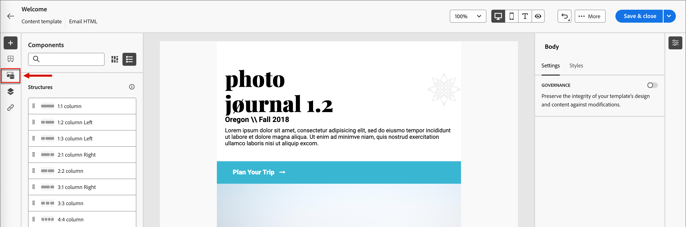

# Werken met Marketo&#39;s Engage

Marketo Engage Design Studio is de standaardbron van middelen voor Journey Optimizer B2B Edition en u kunt de beschikbare middelen in inhoud eenvoudig beheren en gebruiken voor uw accountreizen.

## Bladeren en toegang krijgen tot elementen

Ga naar de linkernavigatie en klik op **[!UICONTROL Content Management]** > **[!UICONTROL Assets]** om Adobe Marketo Engage Design Studio-elementen vanuit Journey Optimizer B2B Edition te openen. Met deze handeling wordt een aanbiedingspagina geopend met alle vermelde elementen.

{width="600" zoomable="yes"}

* Om de activa door omslag te bekijken, open de omslagstructuur door _te klikken toont Omslagen_ pictogram op de bovenkant verlaten.

* Als u de tabel op een van de kolommen wilt sorteren, klikt u op de kolomtitel.

* Als u naar een afbeeldingselement in de geselecteerde map wilt zoeken, voert u een tekstreeks in de zoekbalk in.

* Om de kolommen aan te passen die in de lijst worden getoond, klik _aanpassen lijst_ pictogram op het hoogste recht.

  Selecteer de kolommen die u in de lijst wilt weergeven en klik op **[!UICONTROL Apply]** .

## Elementdetails weergeven

Klik op de naam van een element om de pagina met elementdetails te openen.

## Middel weergeven dat wordt gebruikt door verwijzingen

Klik op de pagina met elementdetails op het tabblad **[!UICONTROL Used By]** om details weer te geven over waar het element momenteel wordt gebruikt in Journey Optimizer B2B Edition, in e-mails, e-mailsjablonen en fragmenten.

>[!IMPORTANT]
>
>Om het even welk element dat momenteel _IN GEBRUIK_ in om het even welke e-mail, e-mailmalplaatjes, of fragmenten **is kan niet** worden geschrapt.

De verwijzingen worden getoond door categorie: _E-mail_, _E-mailmalplaatje_, of _Fragment_. E-mails in Journey Optimizer B2B Edition worden ingesloten en geschreven binnen reizen, zodat de bovenliggende reis van de e-mail die het element gebruikt, wordt weergegeven in verwijzingen.

Als u op de koppeling klikt, wordt u naar het bijbehorende e-mailbericht, de bijbehorende e-mailsjabloon of het bijbehorende fragment geleid waar het element wordt gebruikt.

## Elementen toevoegen

Vanuit de Assets-lijstpagina kunt u afbeeldingselementen toevoegen aan de Adobe Marketo Engage Design Studio.

1. Klik op **[!UICONTROL Add Assets]** rechtsboven.

1. Sleep in het dialoogvenster _[!UICONTROL Add assets]_een of meer bestanden van uw systeem naar het bestandsvak.

   {width="500" zoomable="yes"} toe

   U kunt ook op de koppeling _[!UICONTROL Select a file from your computer]_klikken om bestanden te zoeken en te selecteren met uw lokale bestandssysteem.

   U kunt elementen uploaden vanaf uw lokale systeem met maximaal 10 bestanden tegelijk. De maximale bestandsgrootte is 100 MB.

   De bestandsnamen van de geselecteerde afbeeldingen worden weergegeven in het dialoogvenster. Namen van elementbestanden moeten uniek zijn (in verschillende mappen). Als er al een bestand met de naam bestaat, wordt er een bericht weergegeven. Namen kunnen maximaal 100 tekens hebben en mogen geen speciale tekens bevatten (zoals `;` , `:` , `\` en `|` ).

1. Selecteer de doelmap om de elementen op te slaan met de mapkiezer.

1. Schakel het selectievakje **[!UICONTROL Overwrite existing files]** in als u bestanden wilt overschrijven (vervangen) wanneer u een of meer bestanden met een bestaande bestandsnaam uploadt.

1. Klik op **[!UICONTROL Add]**.

## Elementen verwijderen

Middelen die momenteel worden gebruikt in e-mails, e-mailsjablonen of fragmenten, kunnen niet worden verwijderd. Controleer de gebruikte verwijzingen voordat u een elementverwijdering start. Een verwijderactie kan ook niet ongedaan worden gemaakt, dus controleer deze voordat u een verwijderactie start.

U kunt een element op een van de volgende manieren verwijderen:

* Ga naar de elementdetails, klik op **[!UICONTROL ... More]** rechtsboven en kies **[!UICONTROL Delete]** uit de opties.

  {width="500" zoomable="yes"}

* Voor de _[!UICONTROL Assets]_lijstpagina, klik de_ Ellipse _(**[!UICONTROL ...]**) naast het activa punt en kies **[!UICONTROL Delete]**van de opties.

  {width="500" zoomable="yes"}

Met deze handeling wordt een bevestigingsvenster geopend. U kunt het proces afbreken door op **[!UICONTROL Cancel]** te klikken of op **[!UICONTROL Delete]** te klikken om het verwijderen te bevestigen.

Als het element momenteel in gebruik is, wordt een informatief dialoogvenster geopend waarin u wordt gewaarschuwd dat het niet kan worden verwijderd. Klik op **[!UICONTROL OK]** , die het verwijderen afbreekt.

## Elementen vervangen

U kunt een element op een van de volgende manieren vervangen:

* Ga naar de elementdetails, klik op **[!UICONTROL ... More]** rechtsboven en kies **[!UICONTROL Replace]** uit de opties.

* Voor de _[!UICONTROL Assets]_lijstpagina, klik de_ Ellipse _(**[!UICONTROL ...]**) naast het activa punt en kies **[!UICONTROL Replace]**van de opties.

Sleep het vervangende bestand van uw systeem naar het bestandsvak in het dialoogvenster _[!UICONTROL Replace asset]_. U kunt ook op de koppeling_[!UICONTROL Select a file from your computer]_ klikken om een bestand te selecteren met uw lokale bestandssysteem. (Als u meerdere bestanden op uw lokale systeem selecteert, wordt het eerste geselecteerde bestand gebruikt voor de vervanging.)

{width="500" zoomable="yes"}

Klik op **[!UICONTROL Replace]** om door te gaan. U kunt het proces afbreken door op **[!UICONTROL Cancel]** te klikken.

Als het te vervangen bestand momenteel in gebruik is, wordt in een informatiedialoogvenster gemeld dat het nieuwe afbeeldingsbestand de afbeelding vervangt op alle plaatsen waar het wordt gebruikt (e-mails, e-mailsjablonen en fragmenten).

## Elementen downloaden

U kunt een element op een van de volgende manieren downloaden:

* Ga naar de elementdetails en klik op **[!UICONTROL Download]** rechtsboven.

* Voor de _[!UICONTROL Assets]_lijstpagina, klik de_ Ellipse _(**[!UICONTROL ...]**) naast het activa punt en kies **[!UICONTROL Download]**van de opties.

Klik in het bevestigingsvenster op **[!UICONTROL Download]** om het element naar uw lokale systeem te downloaden. U kunt het proces afbreken door op **[!UICONTROL Cancel]** te klikken.

## Handelingen in bulk toepassen op geselecteerde elementen

Selecteer op de aanbiedingspagina (_[!UICONTROL Content Management]_>_[!UICONTROL Assets]_ ) meerdere elementen tegelijk door elk selectievakje links van elkaar te selecteren. Onderaan wordt een berichtenbanner weergegeven wanneer u meerdere elementen selecteert.

{width="700" zoomable="yes"}

U kunt de volgende acties bulksgewijs uitvoeren:

+++Elementen verplaatsen

1. Voor de selectiebanner, klik **Beweging**.

   Deze actie opent de _[!UICONTROL Move Assets]_dialoog, die van de namen van de geselecteerde activa een lijst maakt en u toestaat om de_ doel _omslag te selecteren waar u deze activa wilt bewegen.

1. Selecteer een map.

   Het pad wordt bijgewerkt naast _[!UICONTROL Selected assets will move to:]_.

1. Klik op **[!UICONTROL Move]**.

+++

+++Elementen verwijderen

>[!NOTE]
>
>U kunt een bulksgewijs verwijderen toepassen voor maximaal 20 geselecteerde elementen.

1. Klik op **[!UICONTROL Delete]** in de selectiebanner.

1. Klik op **[!UICONTROL Delete]** in het bevestigingsdialoogvenster.

   Als een van de geselecteerde elementen momenteel wordt gebruikt, wordt het verwijderen van dat element afgebroken en wordt een waarschuwingsbericht weergegeven.

+++

## Een map maken

1. Klik in de aanbiedingspagina van _[!UICONTROL Assets]_op **[!UICONTROL Create Folder]**rechtsboven.

1. Voer in het dialoogvenster de mapnaam in en selecteer de doelmap (bovenliggende map) voor de nieuwe map.

   Mapnamen moeten uniek zijn, mogen maximaal 100 tekens bevatten en mogen geen speciale tekens bevatten, zoals `;` , `:` , `\` , `|` .

   {width="500"}

1. Klik op **[!UICONTROL Add]**.

## Handelingen op mapniveau toepassen

U kunt acties toepassen op een map of middelen in de map. Klik op het pictogram met de ovalen (**...** ) voor de map om de opties voor handelingen op de map weer te geven.

{width="500"}

U kunt de volgende acties op mapniveau uitvoeren:

+++Elementen toevoegen

1. Kies **[!UICONTROL Add assets]** om afbeeldingsbestanden naar de map te uploaden.

1. Sleep de bestanden vanuit uw systeem naar het dialoogvenster _[!UICONTROL Add assets]_. U kunt ook op de koppeling klikken om de bestanden te selecteren met uw bestandssysteem.

   U kunt elementen van uw lokale systeem toevoegen met maximaal 10 bestanden tegelijk. U kunt bestanden overschrijven wanneer u een of meer bestanden met een bestaande bestandsnaam uploadt.

   De bestandsnamen van de geselecteerde afbeeldingen worden weergegeven in het dialoogvenster. Namen van elementbestanden moeten uniek zijn (in verschillende mappen). Als er al een bestand met deze naam bestaat, wordt er een foutbericht weergegeven. Namen kunnen maximaal 100 tekens hebben en mogen geen speciale tekens bevatten (zoals `;` , `:` , `\` en `|` ).

1. Klik op **[!UICONTROL Add]**.

+++

+++Een submap maken

1. Kies **[!UICONTROL Create folder]** .

1. Voer in het dialoogvenster de mapnaam in.

   Mapnamen moeten uniek zijn, mogen maximaal 100 tekens bevatten en mogen geen speciale tekens bevatten, zoals `;` , `:` , `\` , `|` .

1. Klik op **[!UICONTROL Add]**.

+++

+++Naam van de map wijzigen

1. Kies **[!UICONTROL Rename]** .

1. Voer in het dialoogvenster de nieuwe mapnaam in.

   Mapnamen moeten uniek zijn, mogen maximaal 100 tekens bevatten en mogen geen speciale tekens bevatten, zoals `;` , `:` , `\` , `|` .

1. Klik op **[!UICONTROL Save]**.

+++

+++Verplaats de map

1. Kies **[!UICONTROL Move]** als u de map naar een andere bovenliggende map wilt verplaatsen.

1. Selecteer in het dialoogvenster de doelmap als het nieuwe bovenliggende item voor de submap.

1. Klik op **[!UICONTROL Move]**.

   Als u een map probeert te verplaatsen naar een van de eigen submappen (binnen de structuur van de geselecteerde map), wordt een foutbericht weergegeven en wordt de verplaatsing geannuleerd.

+++

++ + verwijder de map

1. Kies **[!UICONTROL Delete]** .

1. Klik op **[!UICONTROL Delete]** in het bevestigingsdialoogvenster.

Als een van de elementen in de map momenteel in gebruik is, wordt een waarschuwingsvenster geopend met de melding dat deze niet kunnen worden verwijderd. Klik op **[!UICONTROL OK]** om het verwijderen af te breken.

+++

+++Omzetten in een archiefmap

Als u een map archiveert, kunnen de bestanden in de map niet worden doorzocht. Gebruik de archieffunctie voor middelenbestanden waarvan u niet wilt dat uw teamlid de voortgang gebruikt, zoals een verouderd promotiebadge voor gebeurtenissen of seizoensgebonden inhoud. Later kunt u het archiveren van een map ongedaan maken als u de inhoud weer beschikbaar wilt maken.

* Kies **[!UICONTROL Convert to archive folder]** . Er wordt een bevestigingsbanner weergegeven om te bevestigen dat de mapstatus is gewijzigd in gearchiveerd.

* Kies **[!UICONTROL Unarchive folder]** . Er wordt een bevestigingsbanner weergegeven om te bevestigen dat de mapstatus is gewijzigd in niet-gearchiveerd.

+++

## Elementen gebruiken in e-mailinhoud

Assets kan worden gebruikt in de e-mail-, e-mailsjabloon- of visuele fragmentauthoring van uw team vanuit de visuele inhoudeditor.

Van de visuele redacteur UI, selecteer het _pictogram van de selecteur van Activa_ op linkerzijbalk.

{width="700" zoomable="yes"}

Met deze actie wijzigt u het deelvenster Gereedschappen waarin een lijst met beschikbare elementen wordt weergegeven. Er zijn meerdere methoden om een afbeeldingselement toe te voegen aan het visuele canvas:

* Sleep een afbeeldingsminiatuur vanuit de linkernavigatie en zet deze neer.

* Voeg een afbeeldingscomponent toe aan het canvas en klik op **[!UICONTROL Browse]** om het dialoogvenster _[!UICONTROL Select Asset from Adobe Marketo Engage]_te openen.

  {width="700" zoomable="yes"} nodig hebt

  In het dialoogvenster kunt u een afbeelding kiezen in de geselecteerde opslagplaats. Klik op **[!UICONTROL Select]** om het element toe te voegen.

  Er zijn hulpmiddelen beschikbaar om u te helpen van de activa de plaats bepalen die u nodig hebt:

   * Klik het _pictogram van de Filter_ op de bovenkant verlaten om de getoonde punten volgens uw criteria te filtreren.

   * Ga tekst op het _gebied van het Onderzoek_ in om de getoonde punten voor een gelijke van de activanaam te filtreren.

  {width="600" zoomable="yes"} nodig hebt
