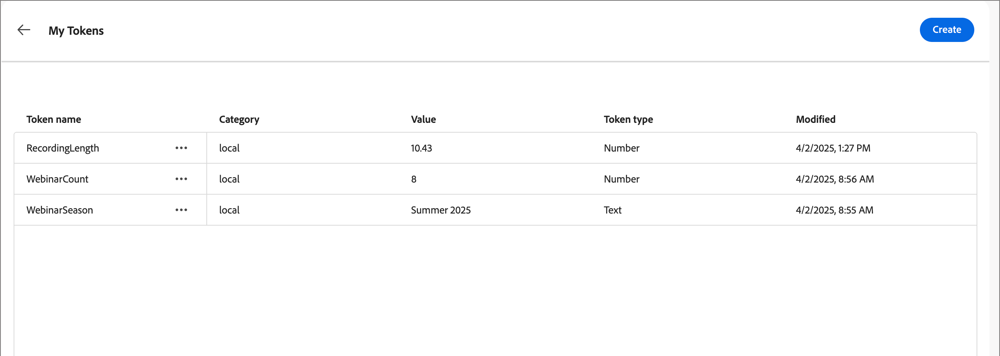

# Aangepaste tokens voor e-mailpersonalisatie

Bij de personalisatie van inhoud worden tokens gebruikt als plaatsaanduidingen of als variabelen die worden gevuld wanneer het inhoudsartefact wordt gegenereerd. Standaardpersonalisatietokens zijn beschikbaar voor e-mails, openingspagina&#39;s, fragmenten en sjablonen. U kunt ook een set aangepaste tokens definiëren met waarden die specifiek zijn voor de accountreis. Deze reeks douanetokens wordt genoemd _Mijn Tokens_ en om het even welk van deze douanetokens zijn voor verpersoonlijking wanneer [&#x200B; creatie reis e-mails &#x200B;](./email-authoring.md#content-authoring---personalization).

Naast _Mijn Tokens_, die voor de rekeningsreis specifiek zijn, kunt u om het even welke standaard (ingebouwde) tokens voor e-mailverpersoonlijking gebruiken.

## Mijn tokens beheren {#my-tokens}

_Mijn Tokens_ zijn douanevariabelen die u creeert of voor een rekeningsreis in de status van het Ontwerp wijzigt. Deze aangepaste tokenset biedt momenteel ondersteuning voor definities van tekst- en getaltokens.

Wanneer u een aangepast token toevoegt aan een e-mailbericht, wordt dit weergegeven als `{{my.TokenName}}` . U hebt bijvoorbeeld `{{my.EventDate}}` - of `{{my.WebinarSpeaker}}` -tokens gemaakt voor het beheer van e-mailinhoud voor komende webinars.

_Om tot de douanetokens voor een rekeningsreis toegang te hebben :_

1. Open de conceptrekeningreis.

1. Klik op het menu **[!UICONTROL More...]** rechtsboven en kies **[!UICONTROL My Tokens]** .

   {width="450"}

   De _Mijn 1&rbrace; pagina van Tokens &lbrace;maakt een lijst van alle douanetokens die voor de reis worden bepaald._

   {width="700" zoomable="yes"}

### Een token maken

1. Klik op de pagina _[!UICONTROL My Tokens]_&#x200B;op **[!UICONTROL Create]**&#x200B;en kies het tokentype dat u wilt definiëren:

   * **[!UICONTROL Text]** - Gebruik dit type om een token met een elementaire tekenreekswaarde te definiëren.

   * **[!UICONTROL Number]** - Gebruik dit type om een token met een numerieke waarde te definiëren.

1. Voer in het dialoogvenster de waarden **[!UICONTROL Name]** en **[!UICONTROL Value]** voor het token in.

   {width="400"} in

   U kunt geen spaties of speciale karakters in de symbolische naam gebruiken. U kunt _camel geval_, zoals `EventType` gebruiken, om een multi-woordnaam te gebruiken die gemakkelijk wordt geïdentificeerd.

   Als u het teken van het a _Aantal_ bepaalt, kan de waarde slechts numerieke karakters bevatten. U kunt een decimale waarde gebruiken.

   {width="400"} in

1. Klik op **[!UICONTROL Add]**.

### Een token bewerken

Terwijl de reis van de rekening in ontwerpstatus blijft, kunt u om het even welke bepaalde Mijn Tokens uitgeven.

1. In de _[!UICONTROL My Tokens]_&#x200B;pagina, klik het_ Meer acties _pictogram (**...**) naast de symbolische naam en kies **[!UICONTROL Edit]**.

   {width="430"}

1. Wijzig in het dialoogvenster de **[!UICONTROL Name]** en **[!UICONTROL Value]** naar wens voor de rit.

   {width="400"}

1. Klik op **[!UICONTROL Edit]**.

### Een token verwijderen

U kunt een douanetoken van de _Mijn Tokens_ lijst schrappen, maar u zou ervoor moeten zorgen dat het momenteel niet in uw reis e-mailinhoud wordt gebruikt.

1. In de _[!UICONTROL My Tokens]_&#x200B;pagina, klik het_ Meer acties _pictogram (**...**) naast de symbolische naam en kies **[!UICONTROL Delete]**.

1. Klik op **[!UICONTROL Delete]** in het bevestigingsdialoogvenster.

## Aangepaste tokens gebruiken in uw inhoud

Wanneer u e-mailinhoud voor uw rekeningsreis creeert, kunt u om het even welke tokens van de _Mijn Tokens_ lijst gebruiken wanneer u de verpersoonlijkingshulpmiddelen in de visuele ontwerpruimte gebruikt.

1. Selecteer de tekstcomponent en klik _verpersoonlijking_ toevoegen ( ) pictogram in de toolbar.

   {width="600"}

   Deze actie opent _geeft Personalization_ dialoog uit. Het dialoogvenster bevat een map _[!UICONTROL My tokens]_&#x200B;in de&#x200B;_[!UICONTROL Personalization Tokens]_ -bibliotheek als er aangepaste tokens zijn gedefinieerd voor de accountreis.

1. Vouw de map **[!UICONTROL My tokens]** uit en klik op **+** of **...** om een van uw aangepaste tokens toe te voegen aan de lege ruimte.

   Desgewenst kunt u aanvullende statische tekst toevoegen.

   {width="700" zoomable="yes"}

1. Klik op **[!UICONTROL Save]**.
