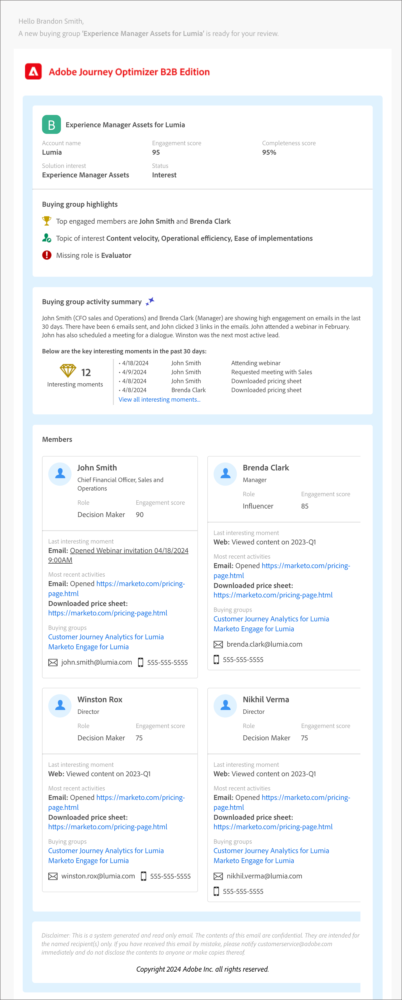

# E-mail met verkoopwaarschuwing

A _de waakzame e-mail van de verkoop_ signaleert de aflevering van het kopen groepen aan Verkoop. Het e-mailbericht bevat een overzicht van de koopgroep en informatie over de leden van de koopgroep en hun activiteiten.

Als marketeer kunt u een e-mailknooppunt voor een melding van verkopen configureren in uw accountreizen om uw verkoopteam te waarschuwen voor de voltooiing van de reis voor bepaalde inkoopgroepen. Binnen de knoop, kunt u de e-mailadressen van het verkoopteam of een distributie alias specificeren die een reeks rekeningen bereikt.

>[!IMPORTANT]
>
>Zorg ervoor dat de lijst van gewenste personen van uw organisatie wordt bijgewerkt zodat een e-mail van het waakzaam bericht van de Verkoop kan worden geleverd. Voor meer informatie, zie [ Protocollen voor het volgen en e-maillevering ](../start/email-protocols.md).

## E-mailinhoud

+++E-mail met verkoopwaarschuwing
{width="500" zoomable="yes"}

+++

| Sectie | Naam | Beschrijving |
| - | ---- | ----------- |
| Groepsgegevens kopen | Naam van kopersgroep | Geef de naam voor de inkoopgroep weer. |
|   | Accountnaam | Naam van de account. |
|   | Betrokkenheidsscore | Betrokkenheidsscore van de koopgroep, gebaseerd op actieve betrokkenheidsactiviteiten in de afgelopen 30 dagen. |
|   | Volledigheidsscore | Volledige score van de koopgroep. |
|   | Oplossingsrente | Belang van de oplossing in verband met de koopgroep&quot; |
|   | Status | Status van de inkoopgroep. |
| Hooglichten van kopersgroepen | Meest betrokken leden | Meest betrokken leden van de kopende groep door de betrokkenheidsscore en rol van groepslid te kopen. |
|   | Onderwerp van belang | De meest voorkomende trefwoorden in de betrokkenheid bij inhoud, op basis van e-mails, downloads, chatten, PDF-revisie, activiteitenoverzicht en webinar vragen. |
|   | Ontbrekende rollen | Verplichte rollen in de template, maar ontbreken in de kopende groep. |
| Samenvatting van kopersgroep | Overzicht van de activiteiten (aangedreven door Generative AI) | Door de AI gegenereerde samenvatting van de koopgroep op basis van de activiteiten van de leden. De activiteiten van de afgelopen 30 dagen worden in overweging genomen. |
|   | Belangrijke opmerkingen | Recente interessante momenten met betrekking tot de leden van de inkoopgroep. |
| Leden | Lijst van vier leden die kopen | Details van de vier belangrijkste koopgroepsleden per betrokkenheidsscore en rol. |
| Elk lid van de inkoopgroep | Lidnaam | Naam van het koopgroeplid. |
|   | Titel | Titel van het koopgroeplid. |
|   | Functie | The Buying group role of the member. |
|   | Betrokkenheidsscore | Betrokkenheidsscore van groepslid kopen. De score is gebaseerd op actieve betrokkenheidsactiviteiten in de afgelopen 30 dagen. |
|   | Laatste interessante moment | Het meest recente interessante moment had betrekking op het lid. |
|   | Meest recente activiteiten | De laatste twee activiteiten hadden betrekking op het lid van de koopgroep. |
|   | E-mailid | E-mailadres van het koopgroeplid. |
|   | Telefoonnummer | Telefoonnummer van het koopgroeplid. |

## Een e-mailactie voor een verkoopwaarschuwing toevoegen aan een accountreis

U kunt e-mailleveringen voor meldingen bij verkoop instellen in een accountreis wanneer u een knooppunt _[!UICONTROL Take an action]_&#x200B;toevoegt en het volgende doet:

1. Kies **[!UICONTROL Account]** voor het doel _[!UICONTROL Action on]_.

1. Kies **[!UICONTROL Send Sales Alert]** bij _[!UICONTROL Action on accounts]_.

1. Kies bij **[!UICONTROL Select solution interest]** de interesse van de oplossing die u wilt gebruiken voor de gegenereerde e-mailinhoud.

1. Voer bij **[!UICONTROL Send Email To]** elk e-mailadres of elke alias in die u voor de levering wilt opnemen.

   {width="600" zoomable="yes"}

   Nadat de rekeningreis is gepubliceerd, wordt de verkoopwaarschuwing geleverd volgens deze parameters.
