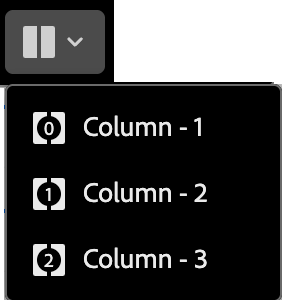

# Structuurelementen {#structure-components}

>[!CONTEXTUALHELP]
>id="ajo-b2b_structure_components_email"
>title="Informatie over structuuronderdelen"
>abstract="Structuurcomponenten zijn lay-outelementen die u kunt gebruiken om de structuur van een e-mailbericht te ontwerpen."

>[!CONTEXTUALHELP]
>id="ajo-b2b_structure_components_landing_page"
>title="Informatie over structuuronderdelen"
>abstract="Structuurcomponenten zijn lay-outelementen die u kunt gebruiken om de structuur van een pagina te ontwerpen."

>[!CONTEXTUALHELP]
>id="ajo-b2b_structure_components_fragment"
>title="Informatie over structuuronderdelen"
>abstract="Structuurcomponenten zijn lay-outelementen die u kunt gebruiken om de structuur van een fragment te ontwerpen."

>[!CONTEXTUALHELP]
>id="ajo-b2b_structure_components_template"
>title="Informatie over structuuronderdelen"
>abstract="Structuurcomponenten zijn lay-outelementen die u kunt gebruiken om de structuur van een sjabloon te ontwerpen."

Gebruik de _componenten van de Structuur_ in de visuele ontwerpruimte om de structuur van uw inhoud te bepalen. Door structuurelementen toe te voegen en te bewegen met eenvoudige belemmering-en-dalingsacties, kunt u de vorm van uw inhoudslay-out snel bepalen. Elke structuurcomponent beslaat de horizontale ruimte en u kunt deze stapelen om de lay-out verticaal te bouwen. Verdeel elke component in kolommen om elk inhoudsblok te vormen dat u nodig hebt.

## Structuurbibliotheek

Boven aan de _[!UICONTROL Components]_-bibliotheek worden in de sectie **[!UICONTROL Structures]**&#x200B;de beschikbare structuurcomponenten weergegeven:

| Pictogram | Component. | Beschrijving |
| ----- | ----------- | ----------- |
|  | [!UICONTROL 1:1 column &#x200B;] | Eén kolomcontainer waarmee de breedte van de ruimte wordt gevuld. |
|  | [!UICONTROL 1:2 column Left &#x200B;] | Een container met twee kolommen die een 1 :2 verhouding gebruikt om de breedte van de ruimte te vullen. De eerste kolom (links) neemt een derde van de breedte in en de tweede kolom (rechts) neemt de resterende twee derde in beslag. |
|  | [!UICONTROL 1:3 column Left &#x200B;] | Een container met twee kolommen die een 1 :3 verhouding gebruikt om de breedte van de ruimte te vullen. De eerste kolom (links) neemt een vierde van de breedte in en de tweede kolom (rechts) neemt de resterende drie vierden in beslag. |
|  | [!UICONTROL 2:1 column Right &#x200B;] | Een container met twee kolommen die een 2 :1 verhouding gebruikt om de breedte van de ruimte te vullen. De eerste (linker) kolom neemt twee derde van de breedte in beslag en de tweede (rechterkolom) neemt de resterende eenderde in beslag. |
|  | [!UICONTROL 2:2 column &#x200B;] | Een container met twee kolommen die een 2 :2 verhouding gebruikt om de breedte van de ruimte te vullen. De linker- en rechterkolommen zijn even breed. |
|  | [!UICONTROL 3:1 column Right &#x200B;] | Een container met twee kolommen die een verhouding van 3 :1 gebruikt om de breedte van de ruimte te vullen. De eerste (linker) kolom neemt een driekwart (75%) van de breedte in en de tweede (rechterkolom) neemt de resterende eenvierde (25%) in beslag. |
|  | [!UICONTROL 3:3 column &#x200B;] | Een container met drie kolommen die een verhouding van 3 :3 gebruikt om de breedte van de ruimte te vullen. Alle drie de kolommen zijn even breed. |
|  | [!UICONTROL 4:4 column &#x200B;] | Een container met vier kolommen die een 4 :4 verhouding gebruikt om de breedte van de ruimte te vullen. Alle vier de kolommen zijn gelijk in breedte. |
|  | [!UICONTROL n:n column &#x200B;] | Een aanpasbare kolomstructuur die de ruimte vult volgens de kolommen die u definieert. U stelt het aantal kolommen (tussen twee en tien) in en stelt de breedte van elke kolom afzonderlijk in. [Meer informatie](#change-nn-columns) |

## Structuurcomponenten toevoegen

Wanneer u de inhoud voor uw e-mail, bestemmingspagina, of fragment ontwerpt, voeg elke structuurcomponent toe om de lay-out te construeren. Sleep een item vanuit de sectie **[!UICONTROL Structures]** aan de linkerkant en zet het neer op het canvas. U kunt de toolbar gebruiken om een kolom te selecteren en de _Montages_ te gebruiken en _de lusjes van Stijlen_ op het juiste paneel om de parameters voor de geselecteerde component of de kolom te bepalen.

{width="800" zoomable="yes"}

### Component, werkbalk

De werkbalk wordt weergegeven op het canvas wanneer u deze selecteert op het canvas. Met de beschikbare gereedschappen kunt u op eenvoudige wijze een kolom selecteren en componentfuncties toepassen.

{width="150"}

| Gereedschap | Naam | Gebruik |
| ---- | ---- | ----- |
| {width="40"} toe | Voorwaardelijke inhoud inschakelen | Voorwaardelijke varianten voor de component inschakelen. [Meer informatie](./conditional-content.md) |
| {width="100"} | Een kolom selecteren | Selecteer een kolom op aantal. Als de kolom is geselecteerd, kunt u kolominstellingen en stijlen toepassen. |
| {width="40"} | Dupliceren | Maak een kopie van de component en voeg deze direct hieronder toe. |
| {width="40"} | Verwijderen | Verwijder de component. |

### Componentinstellingen

Nadat u een component hebt toegevoegd, wordt deze geselecteerd in de ruimte van het visuele ontwerp en worden de eigenschappen ervan weergegeven in het rechterdeelvenster. Het tabblad _[!UICONTROL Settings]_&#x200B;wordt standaard weergegeven. U kunt ook op elk gewenst moment een structuurcomponent selecteren om de instellingen te wijzigen.

#### Weergaveopties

Wijzig de instelling **[!UICONTROL Display Options]** als u de component wilt uitsluiten van de weergave van het bureaublad of het mobiele apparaat. Met de standaardwaarde, _[!UICONTROL Show on all devices]_, wordt weergave op alle apparaten ingeschakeld.

{width="400" zoomable="yes"}

Kies een andere instelling om de component op apparaattype exclusief te maken:

* _[!UICONTROL Show only on desktop devices]_- Kies deze instelling wanneer u de component wilt weergeven op bureaubladapparaten en deze wilt uitsluiten voor mobiele apparaten.
* _[!UICONTROL Show only on mobile devices]_- Kies deze instelling als u de component wilt weergeven op mobiele apparaten, zoals telefoons en tablets, en deze wilt uitsluiten voor bureaubladapparaten.

#### Koptekst en voettekst

U kunt een structuurcomponent toewijzen als de HTML-kop- of voettekst in het e-mailbericht of de bestemmingspagina. Selecteer de structuurcomponent op het canvas en klik op de optie **[!UICONTROL Header]** of **[!UICONTROL Footer]** . Er kan slechts één kop- of voettekst zijn en de optie is niet beschikbaar als een andere component is toegewezen.

{width="600" zoomable="yes"} wordt geplaatst

U kunt de kop- of voettekstaanduiding verwijderen door de component te selecteren en op de optie te klikken om deze te verwijderen.

### Gestapelde kolommen

Voor kleinere schermen of weergavevensters worden de kolommen in de component Structuur als gestapeld weergegeven, tenzij u de standaardinstelling wijzigt. Selecteer de structuurcomponent met meerdere kolommen en wijzig de instelling van **[!UICONTROL Do not stack columns on mobile]** door de schuifregelaar naar rechts te verplaatsen.

{width="250"}

## Componentstijlen

Nadat u een component hebt toegevoegd, wordt deze geselecteerd in de ruimte van het visuele ontwerp en worden de eigenschappen ervan weergegeven in het rechterdeelvenster. U kunt ook op elk gewenst moment een component selecteren om de instellingen en stijlen te wijzigen.

### Achtergrond

Selecteer het tabblad _[!UICONTROL Styles]_&#x200B;in het rechterdeelvenster en gebruik de sectie **[!UICONTROL Background]**&#x200B;om de kleur en optionele afbeelding te definiëren die u als achtergrond voor de structuurcomponent wilt gebruiken.

#### [!UICONTROL Background color]

Schakel het selectievakje in en klik op het kleurvakje om een kleur in de kiezer te kiezen. U kunt een kleur kiezen door een bekende RGB-, HSL-, HSB- of hexadecimale waarde in te voeren. U kunt ook de kleurschuifregelaar en het kleurveld gebruiken om de kleur te selecteren.

{width="300"}

#### [!UICONTROL Background image]

Verplaats de schakelkiezer om de achtergrondafbeeldingsinstellingen in te schakelen.

{width="250"}

Kies het [ type van middelbron 0&rbrace; ](./assets-overview.md) en selecteer het beelddossier:

+++[!UICONTROL Marketo Engage Assets]

{{me-dam}}

+++

+++[!UICONTROL Experience Manager Assets]

{{aem-assets-dam}}

+++

+++[!UICONTROL Import media]

{{image-upload}}

+++

Gebruik de optie **[!UICONTROL Image placement]** om te kiezen hoe de afbeelding de structuurcomponent vult. De plaatsingsmontages volgen de standaard [ de achtergrondbeeldvulling en groeperingsattributen van HTML ](https://www.w3schools.com/html/html_images_background.asp){target="_blank"}.

{width="250"}

### Overige stijlen

U kunt andere stijlen voor structuurcomponenten toepassen om de weergave in het e-mailbericht of de bestemmingspagina aan te passen.

+++Rand

{{styles-border}}

+++

+++Marge

{{styles-margin}}

+++

+++Geavanceerd

{{styles-advanced}}

+++

## Kolommen

Gebruik _selecteer een kolom_ hulpmiddel in de componententoolbar om een kolom te selecteren. Vervolgens kunt u de kolomwerkbalk gebruiken om de kolomselectie te wijzigen, de kolom te verwijderen of om variaties in de voorwaardelijke inhoud toe te passen voor de kolom. De parameters voor de kolom worden weergegeven op de tabbladen _[!UICONTROL Settings]_&#x200B;en&#x200B;_[!UICONTROL Styles]_ rechts.

{width="500"}

| Gereedschap | Naam | Gebruik |
| ---- | ---- | ----- |
| {width="40"} | Kolom wissen | Wis de inhoud in de kolom. |
| {width="40"} toe | Voorwaardelijke inhoud inschakelen | Voorwaardelijke varianten voor de kolom inschakelen. [Meer informatie](./conditional-content.md) |
| {width="100"} | Een kolom selecteren | Selecteer een kolom op aantal. Als de kolom is geselecteerd, kunt u instellingen en stijlen toepassen. |

### Kolommen n:n wijzigen

De kolombreedten zijn statisch voor de meeste structuurcomponenten. Wanneer u de _[!UICONTROL n:nkolom]_ component toevoegt, kunt u het aantal kolommen en het kolomrangschikken veranderen. De n :n kolomcomponent begint met vijf kolommen van gelijke breedte (20%).

>[!NOTE]
>
>Elke kolomgrootte mag niet kleiner zijn dan 10% van de totale breedte van de structuurcomponent. Alleen lege kolommen kunnen worden verwijderd.

Selecteer de component op het canvas en gebruik de optie **[!UICONTROL Columns number]** in het rechterdeelvenster om het aantal kolommen te wijzigen. Klik op de pictogrammen Pijl-omhoog en Pijl-omlaag om het aantal kolommen te vergroten of te verkleinen of voer het aantal kolommen in het veld in.

{width="650" zoomable="yes"}

Verplaats op het canvas het pictogram voor kolomgrootte om de breedte van de geselecteerde kolom aan te passen. Als u de breedte vergroot of verkleint, wordt de aangrenzende kolom ook zo aangepast dat alle kolommen 100% van de breedte van de component beslaan.

{width="500" zoomable="yes"}

### Kolomstijlen

Als de kolom op het canvas is geselecteerd, kunt u stijlen instellen om op die kolom toe te passen.

+++achtergrond

* **[!UICONTROL Background color]** - Selecteer het selectievakje en klik op het kleurvakje om een kleur in de kiezer te kiezen. U kunt een kleur kiezen door een bekende RGB-, HSL-, HSB- of hexadecimale waarde in te voeren. U kunt ook de schuifregelaar Kleur en het kleurveld gebruiken om de kleur te selecteren.

  {width="300"}

* **[!UICONTROL Background image]** - Verplaats de schakeloptie om de achtergrondafbeeldingsinstellingen in te schakelen.

  {width="250"}

  Kies het activa brontype en [ selecteer een beelddossier ](#background-image).

+++

+++Rand

{{styles-border}}

+++

+++Uitlijning

{{styles-alignment-v}}

+++

+++Marge

{{styles-margin}}

+++

+++Geavanceerd

{{styles-advanced}}

+++

## Navigatiestructuur

In de visuele ontwerpruimte, kunt u tot de structurele componenten, met inbegrip van kolommen en inhoud toegang hebben, gebruikend de navigatieboom. Klik het _[!UICONTROL Navigation tree]_&#x200B;pictogram ( ) op de linkerzijde om de boom te tonen.

{width="800" zoomable="yes"}

Het element _[!UICONTROL Body]_&#x200B;is de basis van de boomstructuur. Klik op een van de componenten of onderliggende kolomelementen in de structuur om deze op het canvas te selecteren. Op de tabbladen&#x200B;_[!UICONTROL Settings]_ en _[!UICONTROL Styles]_&#x200B;rechts ziet u de parameters voor die component of kolom.

{width="800" zoomable="yes"} worden getoond
