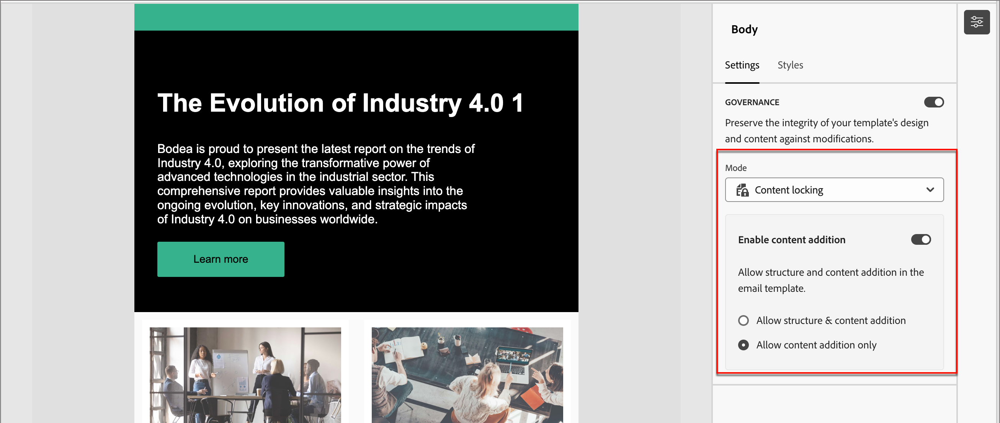

# Beheer van sjablooninhoud

Binnen vele Marketing-organisaties zijn er inhoudsprofessionals die e-mailcampagnes ontwerpen. Een bepaald ontwerp kan worden gebruikt als basis voor reizen van aangepaste accounts in de hele organisatie. Om ervoor te zorgen dat de goedgekeurde inhoudsontwerpen worden nageleefd, kunt u functies voor contentbeheer gebruiken om sjablooncomponenten te vergrendelen. Wanneer de inhoudvergrendeling in de e-mailsjabloon is geactiveerd, kunnen marketers alleen de toegestane elementen wijzigen om de inhoud op één lijn te houden met de inhoudsstrategie.

U kunt bijvoorbeeld de kop- en voettekst vergrendelen die is ontworpen voor de continuïteit van de communicatie met het merk. U kunt ook de kolom vergrendelen die de hoofdtekstsectie bevat, maar auteurs toestaan de tekst zodanig te wijzigen dat deze voldoet aan hun doel in het ontwerp van de accountritme.

## Inhoudsbeheer voor de sjabloon activeren

Nadat u de visuele ontwerper aan [ auteur de structurele en inhoudcomponenten ](./email-template-authoring.md) voor uw e-mailmalplaatje gebruikt, laat bestuur toe en pas specifieke inhoudsafscherping zonodig toe.

1. In de visuele ontwerper, heb toegang tot de lagen/de containers en de elementen gebruikend de _boom van de Navigatie_.

   Klik het _pictogram van de Navigatieboom_ ( ) links van het canvas om de boom te tonen.

1. Selecteer de basiscomponent **[!UICONTROL Body]** in de structuur.

   In het deelvenster Eigenschappen rechts van het canvas wordt standaard de tab _[!UICONTROL Settings]_weergegeven.

1. Schakel de optie **[!UICONTROL Governance]** in.

   {width="800" zoomable="yes"} toe

   Als deze optie is ingeschakeld, is de standaardwaarde _[!UICONTROL Mode]_**[!UICONTROL Read only]**. Als deze modus is ingesteld op het hoofdniveau, worden alle elementen in de sjabloon vergrendeld. De boomstructuur op de linkerzijde toont_ slechts Lees _pictogram ( ) naast de wortel en alle kindelementen.

1. Wijzig **[!UICONTROL Mode]** in **[!UICONTROL Content locking]** als u specifieke inhoudsafsluiting in de sjabloon wilt inschakelen.

   Als deze modus is ingesteld op het hoofdniveau, worden alle elementen in de sjabloon ontgrendeld. De boomstructuur op de linkerzijde toont het _pictogram van de 2} Vergrendeling van de Inhoud_ {naast het wortelelement.  Pas indien nodig inhoudvergrendeling toe op omvattende (structurele) en afzonderlijke inhoudcomponenten.

   Schakel **[!UICONTROL Enable content addition]** in als u wilt dat e-mailauteurs structuur- of inhoudselementen kunnen toevoegen. Kies het type toevoegingen dat u wilt toestaan:

   * **[!UICONTROL Allow structure & content addition]** - Kies deze optie als u wilt dat auteurs structuurelementen en inhoudselementen kunnen toevoegen.

   * **[!UICONTROL Allow content addition only]** - Kies deze optie als u wilt dat auteurs alleen inhoudselementen kunnen toevoegen.

   {width="600" zoomable="yes"} toe

   Als deze modus is ingesteld op het hoofdniveau, worden alle elementen in de sjabloon vergrendeld. De boomstructuur op de linkerzijde toont _slechts Lees_ pictogram ( ) naast de wortel en alle kindelementen.
<!-- 

   
- 
- 
- 
- 
-  -->

## Vergrendeling toepassen op een structuur

Met behulp van het structuuroverervingsmodel plant u de indeling en structuur van uw e-mailsjabloon op basis van het beheer dat u wilt toepassen. Gebruik de structuurcomponenten als containers om items te groeperen op een manier die het voor hen gemakkelijk maakt om aan te geven dat ze zijn vergrendeld of bewerkbaar. Wanneer het ontwerp van de e-mailsjabloon op zijn plaats is, controleert u de structuur en past u vergrendelingsfuncties toe volgens uw abonnement.

Wanneer u een vergrendelingstype op structuurniveau toepast, wordt een standaardinstelling voor de onderliggende componenten toegepast. Vervolgens kunt u desgewenst een specifieke instelling voor vergrendelen op het niveau van de kolom of het inhoudselement toepassen.

1. Klik het _pictogram van de Navigatieboom_ ( ) links van het canvas om de boom te tonen.

1. Selecteer de structuur in de structuur.

   In het deelvenster Eigenschappen rechts van het canvas wordt standaard de tab _[!UICONTROL Settings]_weergegeven.

1. Stel de **[!UICONTROL Lock type]** in:

   * **[!UICONTROL Locked]** - Met deze instelling zijn alle onderliggende componenten standaard vergrendeld. De boomstructuur op de linkerzijde toont _slechts Lees_ pictogram ( ) naast alle kindcomponenten.

   * **[!UICONTROL Editable]** - Met deze instelling zijn alle onderliggende componenten standaard bewerkbaar. In de boomstructuur aan de linkerkant worden geen pictogrammen weergegeven naast de onderliggende componenten.

   {width="800" zoomable="yes"} toe

## Vergrendeling instellen voor een onderliggende component

1. Selecteer de component in de structuur.

   In het deelvenster Eigenschappen rechts van het canvas wordt standaard de tab _[!UICONTROL Settings]_weergegeven.

1. Schakel de optie **[!UICONTROL Use specific locking]** in.

1. Kies het type bestuur dat u wilt toepassen:

   * **[!UICONTROL Editable]** - Hiermee kunt u tijdens het ontwerpen van e-mail de volledige redactionele controle over de component uitvoeren.
   * **[!UICONTROL Editable content only]** - Hiermee kunnen auteurs van e-mailberichten de inhoud wijzigen, maar niet de component zelf.
   * **[!UICONTROL Locked]** - Hiermee voorkomt u dat de component wordt gewijzigd tijdens het ontwerpen van e-mail.

     Voor een vergrendelde component kunt u het verwijderen van de component tijdens het ontwerpen van e-mail toestaan door de optie **[!UICONTROL Allow delete]** in te schakelen.

   {width="800" zoomable="yes"} toe
