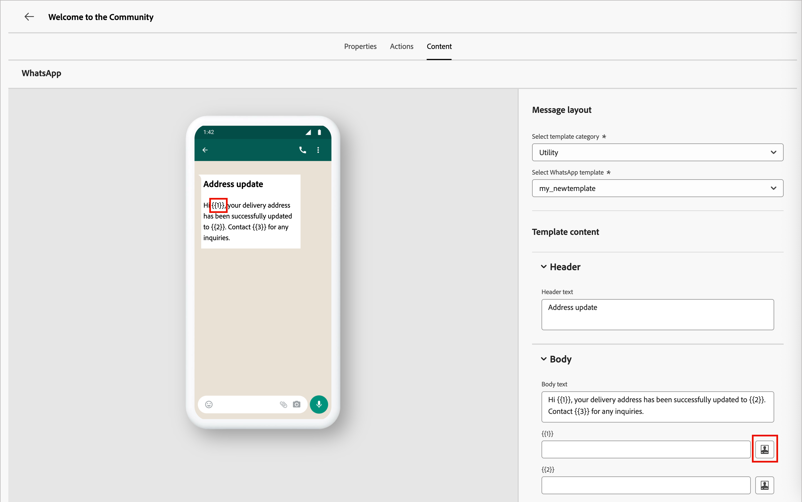

# WhatsApp-authoring

Met Adobe Journey Optimizer B2B edition kunt u WhatsApp-berichten verzenden naar accountleden op hun mobiele apparaten. U kunt berichten maken, personaliseren en voorvertonen met goedgekeurde Meta-berichtsjablonen in de WhatsApp-editor. <!-- Test your WhatsApp messages before publishing the account journey to ensure your intended rendering, accurate personalization, and proper configuration of all settings. -->

Alvorens berichten WhatsApp voor rekeningsreizen te creëren, zorg ervoor dat u het nodig [ WhatsApp gevormde kanaal WhatsApp ](../admin/configure-channels-whatsapp.md) in de _[!UICONTROL Administrator]_montages hebt.

>[!NOTE]
>
>Slechts _uitgaande_ WhatsApp berichtelementen worden gesteund in Journey Optimizer B2B edition.

+++ Ondersteunde berichtelementen en aanroepen van actieopties

De volgende berichttypes worden gesteund in WhatsApp:

| Berichtelement | Beschrijving |
| - | - |
| Kopteksten | Optionele tekst die boven de hoofdtekst van het bericht wordt weergegeven. |
| Tekst | Ondersteunt dynamische inhoud via parameters. |
| Afbeeldingen (JPEG, PNG) | Moet 8-bits RGB- of RGBA-indeling hebben en moet kleiner zijn dan 5 MB. |
| Video&#39;s | Moet 3GPP of MP4 zijn, minder dan 16 MB, en worden gehost via URL. |
| Audio | Alleen beschikbaar voor responsberichten. Dit moet de indeling AAC, AMR, MP3, MP4 audio of OGG hebben, die wordt gehost op een URL en minder dan 16 MB. |
| Documenten | Moet kleiner zijn dan 100 MB en worden gehost op een URL en in een van de volgende indelingen: `.txt`, `.xls`/`.xlsx`, `.doc`/`.docx`, `.ppt`/`.pptx` of `.pdf` . |
| Platte tekst | Ondersteunt dynamische inhoud via parameters. |
| Voettekst | Ondersteunt dynamische inhoud via parameters. |

De volgende call-to-action-opties zijn beschikbaar voor whatsApp-berichten:

| Call to action | Beschrijving |
| - | - |
| Bezoek website | Slechts één knop is toegestaan, met variabele parameters inbegrepen. |
| Bellen op WhatsApp | Verstrekt een knoop die een praatje WhatsApp met het gespecificeerde telefoonaantal van het bericht direct opent. |
| Telefoonnummer bellen | Verstrekt een knoop die een telefoonvraag aan het gespecificeerde aantal in werking stelt wanneer getikt door de gebruiker. |

+++

## Een WhatsApp-actie toevoegen aan een accountreis

U kunt opstelling whatsApp berichtleveringen in een rekeningsreis wanneer u [ a _[!UICONTROL Take an action]_knoop ](../journeys/action-nodes.md) toevoegt en het volgende doet:

1. Kies **[!UICONTROL People]** voor het doel _[!UICONTROL Action on]_.

1. Kies **[!UICONTROL Send WhatsApp]** bij _[!UICONTROL Action on people]_.

   {width="500" zoomable="yes"}

## Het whatsApp-bericht maken

1. Klik onder aan het deelvenster _[!UICONTROL Take an action]_op **[!UICONTROL Create WhatsApp]**.

1. Voer in het dialoogvenster een uniek **[!UICONTROL Name]** (vereist) en **[!UICONTROL Description]** (optioneel) voor het WhatsApp-bericht in.

   {width="400"}

1. Klik op **[!UICONTROL Create]** .

   De _whatsApp ontwerpruimte_ opent waar u de acties kunt bepalen WhatsApp en de inhoud creëren voor het verzenden van het bericht.

### Selecteer de actieconfiguratie

1. In de _whatsApp ontwerpruimte_, selecteer het **[!UICONTROL Actions]** lusje.

1. Voor **[!UICONTROL WhatsApp configuration]**, selecteer de [ configuratie ](../admin/configure-channels-whatsapp.md#create-channel-configuration) die de marketing acties en de montages van de berichtlevering voor uw behoeften steunt.

   {width="700" zoomable="yes"}

1. Klik op **[!UICONTROL Edit content]** om naar de berichtparameters en tekst te gaan.

### Een berichtsjabloon selecteren

>[!IMPORTANT]
>
>**WhatsApp toestemmingsbeheer**: In overeenstemming met het beleid van Meta en toepasselijke verordeningen, moeten alle WhatsApp marketing berichten slechts naar ontvangers worden verzonden die binnen hebben gekozen om mededelingen te ontvangen. Ontvangers van whatsApp kunnen te allen tijde de optie Weigeren kiezen door te reageren op een uitschakeltrefwoord. De antwoorden van de optie-uit worden automatisch gerespecteerd, en de overeenkomstige profielen worden verwijderd uit toekomstig marketing berichtpubliek.

WhatsApp-berichten worden verzonden met vooraf goedgekeurde berichtsjablonen van uw Meta WhatsApp Business-account. **de Malplaatjes moeten door Meta** worden herzien en worden goedgekeurd alvorens u hen in Journey Optimizer B2B edition kunt gebruiken. Werk samen met uw [!DNL Meta Business Manager] -accountbeheerder om sjablonen te beheren en ter goedkeuring in te dienen.

1. Kies bij **[!UICONTROL Select template category]** een van de volgende opties:

   * Marketing
   * Hulpprogramma
   * Verificatie

1. Kies voor **[!UICONTROL Select WhatsApp template]** een goedgekeurde sjabloon voor de zakelijke account voor de configuratie.

   De malplaatjeinhoud laadt in de berichtredacteur, tonend de malplaatjestructuur en om het even welke veranderlijke gebieden beschikbaar voor verpersoonlijking.

   {width="700" zoomable="yes"}

   De malplaatjes worden georganiseerd door categorie (_Marketing_, _Nut_, en _Authentificatie_) en status. Slechts **_goedgekeurde_** malplaatjes zijn beschikbaar voor selectie. Voor meer informatie over het creëren van malplaatjes WhatsApp, zie [_berichtmalplaatjes voor uw Van Bedrijfs WhatsApp rekening_ ](https://www.facebook.com/business/help/2055875911147364?id=2129163877102343) in de documentatie van Meta creëren.

### Afbeeldings-URL&#39;s

Als uw sjabloon afbeeldingen bevat, gebruikt u het veld **[!UICONTROL Image URL]** om media-URL&#39;s toe te voegen ter vervanging van plaatsaanduidingen in uw sjabloon. Meta-sjabloonmedia zijn alleen plaatsaanduidingen. Als u afbeeldingen, audio of video op de juiste wijze wilt weergeven, moet u externe URL&#39;s uit Adobe Experience Manager of andere bronnen gebruiken.

### De inhoud van het bericht aanpassen

Goedgekeurde WhatsApp-sjablonen kunnen plaatsaanduidingen voor variabelen bevatten die u definieert met behulp van profielgegevens of dynamische waarden.

Voor elk veranderlijk gebied dat in het malplaatje wordt getoond, klik __ pictogram  ) naast het gebied.

{width="700" zoomable="yes"}

Het dialoogvenster biedt toegang tot de accounttokens, persoonlijke tokens en systeemtokens. Zowel standaard als aangepaste tokens zijn inbegrepen. U kunt de _bar van het Onderzoek_ gebruiken om van het teken de plaats te bepalen u wenst, of door de omslagboom te navigeren om het even welke tokens te vinden en te selecteren.

Voor gedetailleerde informatie over het gebruiken van tekenen voor verpersoonlijking, zie [ verpersoonlijking van de Inhoud ](./personalization.md).

Wanneer uw personalisatietokens worden bepaald, klik **[!UICONTROL Save]** om veranderingen te bewaren en aan de belangrijkste whatsApp berichtwerkruimte terug te keren.
