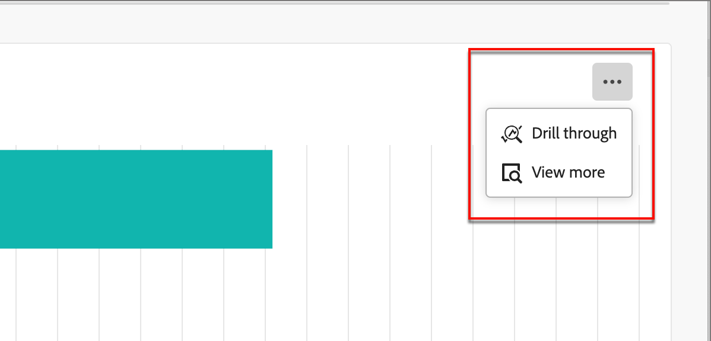

# Het overzichtdashboard voor groepen kopen

Het het overzichtdashboard van de Groep van de Kopen wordt ontworpen voor het proces van de Afhandeling van de Verkoop B2B. Het laat het Marketing team toe om _klaar_ te delen die groepen en hun leden samen met essentiële gegevens aan het team van de Verkoop voor uitvoering kopen. Dit proces zorgt voor een gestroomlijnde overgang van marketing naar verkoop.

De verkoopoverdracht omvat:

* **Gegevens Handoff**: De marketing identificeert _klaar_ doelgegevens en maakt het toegankelijk aan Verkoop in het formaat CSV. 
* **Acceptatie van de Verkoop**: De verkoop herziet manueel en neemt _klaar_ doelstellingen in hun pijpleiding op.

## Status van kopersgroep

Bekijk de voortgang van je inkoopgroepen in de weergave Status van kopersgroep. Deze visualisatie laat de distributie zien van uw inkoopgroepen die zijn gecategoriseerd door hun meest recente statusupdate binnen een opgegeven tijdsperiode.

{width="800" zoomable="yes"}

**[!UICONTROL Status]** (y-as): volg de reis van het kopen van groepen door diverse stadia.
**[!UICONTROL Number of Buying Groups]** (x-as): kwantificeer het aantal inkoopgroepen bij elke status en geef een duidelijke metrische waarde op van de gezondheid en activiteit van de trechter.
<!-- To generate a shareable PDF of your current view, click **[!UICONTROL Export]** at the top-right corner of the page. -->

### Gegevens filteren

* **de filter van Gegevens** - gebruik _[!UICONTROL Date filter]_, die op de het Kopen datum van de statusverandering van de Groep wijst. De begindatum kan worden aangepast. De einddatum wordt standaard ingesteld op de huidige dag.

  {width="400"}

* **de filter van Attributen** - klik het _3} pictogram van de Filter {bij de bovenkant verlaten om de gegevensvertoning te filtreren gebruikend om het even welk van deze attributen:_

   * Belang van oplossing
   * Status
   * statussen van kopersgroepen
   * Accountregio
   * Accountsector
  <!-- * Account's Industry -->

  {width="500"}

## Betrokkenheid bij de gegevens

Als u gegevens wilt gebruiken, gebruikt u het actiemenu in de rechterbovenhoek.

{width="300"} toegang te hebben

### [!UICONTROL Drill through]

Kies **[!UICONTROL Drill through]** voor een diepgaande analyse van individuele groepsstatussen.

{width="600" zoomable="yes"}

De algemene filters die op het dashboard worden toegepast, worden overgenomen.

Klik het pictogram van het actiemenu op het hoogste recht en kies **[!UICONTROL View more]** aan [ mening uitgebreide gegevens en inzichten ](#view-more).

### [!UICONTROL View more]

Kies **[!UICONTROL View more]** voor uitgebreide gegevens en inzichten. Het weergegeven pop-upvenster bevat een diagram en een tabel met de indeling van de status van de inkoopgroep:

* [!UICONTROL Account ID ]
* [!UICONTROL Account Name]
* [!UICONTROL Account Region]
* [!UICONTROL Account Industry]
* [!UICONTROL Buying Group Name]
* [!UICONTROL Solution Interest]
* [!UICONTROL Status]
* [!UICONTROL Engagement Score]
* [!UICONTROL Completeness Score]
* [!UICONTROL Member Role]
* [!UICONTROL Member Enrolled / Created Date]
* [!UICONTROL Person ID]
* [!UICONTROL Name]
* [!UICONTROL Email]
* [!UICONTROL Title]
* [!UICONTROL Number of Inbound Engagement Activities]
* [!UICONTROL Last engagement date]

{width="600" zoomable="yes"}

Klik op **[!UICONTROL Download CSV]** rechtsboven om de gegevens te downloaden.
