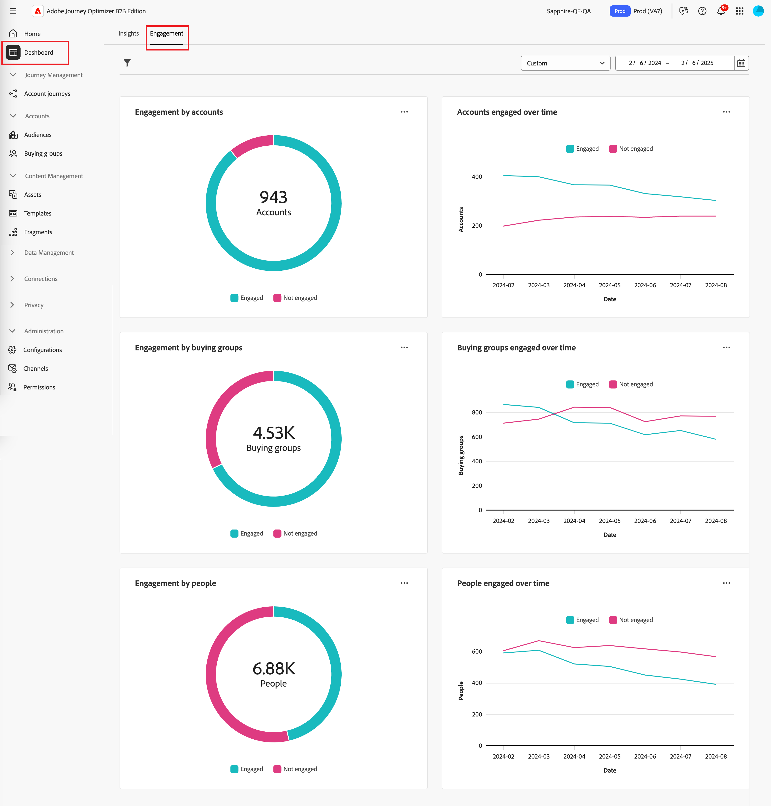

# Het dashboard Betrokkenheid overzicht

Dit dashboard biedt een uitgebreide weergave van betrokkenheid en toont real-time metriek van account en individuele interacties via schenkingsgrafieken en trendonthullende lijngrafieken in de loop der tijd. Het helpt u om uw inspanningen voor betrokkenheid effectief te controleren en te strategisch.

Om tot het _dashboard van de Betrokkenheid_ toegang te hebben, selecteer het **[!UICONTROL Dashboard]** punt in de linkernavigatie. Selecteer vervolgens de tab **[!UICONTROL Engagement]** boven aan de pagina.

<!-- To generate a shareable PDF of your current view, click **[!UICONTROL Export]** at the top-right corner of the page. To engage with the data, use the action menu in the top-right corner. -->

{width="800" zoomable="yes"}

## Betrokkenheid van accounts/groep kopen/mensen

De cirkeldiagrammen verdelen rekeningen, koopgroepen, of mensen in geëngageerde en niet-aangeworven categorieën. Het centrale cijfer toont het totale aantal binnen elke categorie, die een in één oogopslag inzicht van algemene betrokkenheid verstrekt.

{width="500"}

## Rekeningen/koopgroepen/personen die in de loop der tijd betrokken zijn

Deze lijngrafieken geven de betrokkenheidsniveaus van accounts of mensen in de loop van de tijd weer. Met duidelijke regels voor &#39;Engaged&#39; en &#39;Not Engaged&#39; die naast een horizontale as met tijdstempels worden weergegeven, kunt u trends en patronen vaststellen. U kunt de muisaanwijzer op een regel plaatsen om de precieze meetwaarden voor een bepaalde datum weer te geven.

{width="500"}

## De gegevens filteren

U kunt de weergegeven gegevens filteren op datumbereik en kenmerken.

### Filter datumbereik

Gebruik _[!UICONTROL Date range filter]_&#x200B;in de rechterbovenhoek om de gegevens te filteren op basis van het datumbereik.

{width="380"}

Voor het bereik **[!UICONTROL Custom]** kunt u het gereedschap Kalender gebruiken om een begin- en einddatum op te geven. De einddatum wordt standaard ingesteld op de huidige dag.

{width="380"}

### Kenmerk, filter

Klik het _pictogram van de Filter_ (  ) bij de bovenkant verlaten om de getoonde gegevens te filtreren gebruikend om het even welk van deze attributen:

* Oplossingsrente
* Type betrokkenheid
* Regio
* Marktsegment
* Rol van groepslid kopen

{width="500"}

Selecteer zoveel waarden voor elk kenmerk dat u wilt gebruiken om de gegevens te filteren en klik op **[!UICONTROL Apply]** .

## Betrokkenheid bij de gegevens

Als u gegevens wilt gebruiken, gebruikt u het menu **..** rechtsboven in elk diagram.

{width="300"}

### Doorboor

Kies **[!UICONTROL Drill through]** voor een cirkeldiagram voor een diepgaande analyse van de afzonderlijke gegevens over de groepsbetrokkenheid.

De algemene filters (gegevensbereik en kenmerken) worden toegepast op het dashboard. Klik het _pictogram van de Filter_ (  ) bij de bovenkant verlaten aan [&#x200B; verandering de attributenfilters &#x200B;](#filter-the-data) voor de boor-door mening. Gebruik de selecteur van de datumwaaier bij het hoogste recht om [&#x200B; de datumwaaier &#x200B;](#date-range-filter) voor de boor-door mening te veranderen.

{width="700" zoomable="yes"}

| Betrokkenheid per rekening | Betrokkenheid bij het kopen van groepen | Betrokkenheid van mensen |
| ---------------------- | --------------------------- | -------------------- |
| <li>Accountnaam <li>Status <li>Personen in dienst (getal)<li>Betrokkenheid (nummer) <li>Laatste betrokkenheid (datum) | <li>Groep voor kopen <li>Account <li>Oplossingsrente <li>Status <li>Betrokkenheid (nummer) | <li>Naam <li>Status <li>E-mail (adres) <li>Betrokkenheid (nummer) <li>Laatste service (datum) |

U kunt **klikken...** menupictogram bij top-right en kiezen **[!UICONTROL View more]** aan [&#x200B; mening uitgebreide gegevens en inzichten &#x200B;](#view-more).

### Meer weergeven

Kies **[!UICONTROL View more]** voor uitgebreide gegevens en inzichten.

{width="700" zoomable="yes"}

Afhankelijk van de grafiek, zijn er uitgebreide gegevens voor het volgende:

| Betrokkenheid van accounts/inkoopgroepen/mensen | Rekeningen/inkoopgroepen/personen die in de loop der tijd betrokken zijn |
| ----------------------------------------------- | -------------------------------------------------- | 
| <li>Betrokken <li>Niet opgenomen | <li>Datum <li>Accounts/Buying groups / People (number) <li>Betrokken / Niet ingeschakeld |

Als u de uitgebreide gegevens wilt kopiëren, klikt u op **[!UICONTROL Download CSV]** rechtsboven.
