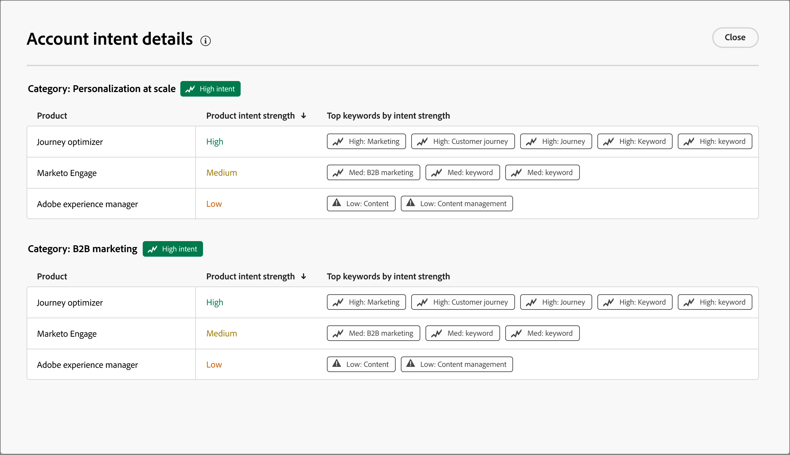

# Intelligent dashboard

Het intelligente dashboard biedt een uitgebreid overzicht van het kopen van maatstaven voor groepen en accounts, zodat u uw marketinginspanningen effectiever kunt volgen en strategisch kunt uitvoeren.

Om tot het _Intelligente dashboard_ toegang te hebben, selecteer het **[!UICONTROL Dashboard]** punt in de linkernavigatie.

{width="800" zoomable="yes"}

Het intelligente dashboard biedt ook toegang tot detailpagina&#39;s van accounts en inkoopgroepen die twee typen generatieve AI-functies bevatten:

* Samenvattingen voor accounts en koopgroepen
* Intentiedetectie voor persoon, inkoopgroep en account

{{intent-data-note}}

Om gebruik te kunnen maken van de informatie en inzichten die door het Intelligente dashboard worden verschaft, moet uw Journey Optimizer B2B edition-exemplaar de vereiste items hebben:

| Type | Vereiste |
| ---- | ----------- |
| [&#x200B; het Kopen groepsstadia &#x200B;](#buying-group-stages) | Opstelling die groepsstadia kopen **en** toevoegen aan gecreeerde het kopen groepen. |
| [&#x200B; het Kopen groepshoogtepunten &#x200B;](#buying-group-highlights) | Opstelling die groepsstadia kopen **en** toevoegen aan gecreeerde het kopen groepen. |
| [&#x200B; de schommeling van de Rekening &#x200B;](#surging-accounts) | Één of meerdere gepubliceerde reizen **of** creeerde het kopen groepen. |
| [&#x200B; de hoogtepunten van de Rekening &#x200B;](#account-highlights) | Één of meerdere gepubliceerde reizen **of** creeerde het kopen groepen. |
| [&#x200B; dekking van het Contact &#x200B;](#contact-coverage) | Een of meer gemaakte inkoopgroepen (fasen niet nodig). |
| [&#x200B; overlap van het contact &#x200B;](#contact-overlap) | Een of meer gemaakte inkoopgroepen (fasen niet nodig). |
| [&#x200B; pagina van de Details van de Rekening &#x200B;](../accounts/account-details.md) | Een of meer gepubliceerde ritten. |
| [&#x200B; het Kopen pagina van het groepsdetail &#x200B;](../buying-groups/buying-group-details.md) | Een of meer gemaakte inkoopgroepen (fasen niet nodig). |

## Groepsfasen voor kopen {#buying-group-stages}

>[!CONTEXTUALHELP]
>id="ajo-b2b_intelligent_dashboard_buying_group_stages"
>title="Groepsfasen voor kopen"
>abstract="Dit diagram biedt een overzicht van het aanschaffen van groepsprogressie in verschillende stadia op basis van de geconfigureerde overgangsregels. De eerste balk geeft het aantal inkoopgroepen in een specifiek stadium op de eerste datum van het geselecteerde tijdkader aan ten opzichte van de laatste datum van het geselecteerde tijdkader."

Het _[!UICONTROL Buying Group Stages]_&#x200B;diagram verstrekt een overzicht van het kopen van groepsvooruitgang over verschillende stadia ([&#x200B; die op overgangsregels worden gebaseerd die door een beheerder &#x200B;](../buying-groups/buying-group-stages.md) worden opstelling).

>[!NOTE]
>
>Voor de beschikbaarheid van de aankoopgroepsfasen moet de aankoopgroepsfase worden geconfigureerd. Zie [&#x200B; het Kopen groepsstadia &#x200B;](../buying-groups/buying-group-stages.md) voor gedetailleerde informatie over stadia en hoe te om stadia voor het kopen van groepen te bepalen en toe te laten.

{width="800" zoomable="yes"}

In de grafiek worden de fasen van de inkoopgroep uit de meest recente gepubliceerde versie van het model van de inkoopgroepfasen gebruikt. Er zijn twee balken voor elk werkgebied. De eerste balk geeft het aantal inkoopgroepen aan op de eerste datum van het geselecteerde tijdkader. En de tweede (in vergelijking) is het aantal koopgroepen op de laatste datum van de tijdsperiode. U kunt de muisaanwijzer boven elke balk houden om het aantal inkoopgroepen in elk stadium te zien.

{width="400"} te bekijken

### Samenvatting van algemene AI

Klik op een balk om een generatieve AI-samenvatting weer te geven van de inkoopgroepen in dat stadium voor de geselecteerde tijdsperiode.

{width="500"} te bekijken

De gegenereerde samenvatting biedt een overzicht van de voortgang van de inkoopgroep in verschillende stadia op basis van de geconfigureerde overgangsregels.

### Tijdsperiode {#time-period-stages}

Gebruik het datumfilter rechtsboven om het datumbereik voor de gegevensvisualisatie te wijzigen. Klik op de pijl-omlaag om een relatief datumbereik in te stellen of om aangepaste begin- en einddatums in te stellen.

<!-- {width="300"} -->

### Kenmerk, filter {#attribute-filter-stages}

Klik het _pictogram van de Filter_ (  uit) bij de bovenkant verlaten om de gegevensvertoning te filtreren gebruikend om het even welk van deze attributen:

* Belang van oplossing
* Account
* Werkgebiednaam

<!-- Add screen when the UI is available {width="500"} -->

## Hooglichten van kopersgroepen {#buying-group-highlights}

>[!CONTEXTUALHELP]
>id="ajo-b2b_intelligent_dashboard_buying_group_highlights_engagement"
>title="Beste 5 inkoopgroepen per service"
>abstract="Meest betrokken inkoopgroepen op basis van hun genormaliseerde betrokkenheidsscore."

>[!CONTEXTUALHELP]
>id="ajo-b2b_intelligent_dashboard_buying_group_highlights_velocity"
>title="Top 5 van aankoopgroepen met hoge snelheid"
>abstract="Groepen kopen op basis van de snelheid waarmee ze door de fasen lopen."

>[!CONTEXTUALHELP]
>id="ajo-b2b_intelligent_dashboard_buying_group_highlights_stagnant"
>title="Top 5 van statische koopgroepen"
>abstract="Stagnant inkoopgroepen die ondanks een hoge volledigheidsscore niet geleidelijk door de verschillende fasen worden geleid."

De sectie _[!UICONTROL Buying group highlights]_&#x200B;is in drie rijen ingedeeld om informatie over de inkoopgroepen weer te geven die van belang zijn voor uw organisatie.

{width="800" zoomable="yes"}

* **Hoogste 5 die groepen door overeenkomst** kopen - Deze rij toont de hoogste betrokken koopgroepen die op hun genormaliseerde betrokkenheidsscore worden gebaseerd.
* **Hoogste 5 Hoge snelheid die groepen** kopen - Deze rij toont de hoogste die groepen kopen die op de snelheid worden gebaseerd waarmee zij door de het kopen groepsstadia vorderen.
* **Hoogste 5 Stagnant het kopen groepen** - Deze rij toont de meest stagnerende het kopen groepen die niet door stadia ondanks een hoge volledigheidsscore progressief zijn.

Elke kaart bevat de volgende gegevens:

* **_het Kopen groepsnaam_**. Klik op de naam om de detailpagina voor de inkoopgroep te openen.
* **_naam van de Rekening_**. Klik op de naam om de pagina met accountdetails te openen (hyperlink naar de pagina met accountdetails).
* **_Huidige stadium_** voor de het kopen groep.
* **_score van de Betrokkenheid_** (genormaliseerd over alle het kopen groepen). Als alle inkoopgroepen dezelfde hoogste score hebben, wordt de laatst bijgewerkte score weergegeven.
* **_score van de Voltooiing_** (die zich van 1-100 uitstrekken). Als alle inkoopgroepen dezelfde hoogste score hebben, wordt de laatst bijgewerkte score weergegeven.
* **_intent van de Categorie_**. Klik op _[!UICONTROL View details]_&#x200B;om de intentgegevens weer te geven:

  {width="500" zoomable="yes"}

   * De detailpopup toont de categorienaam met intentniveau bij de bovenkant.
   * De gegevens voor elke rij worden in kolommen geordend: de productnaam, de sterkte van de productintentie en de bovenste trefwoorden op sterkte van de intentie.
   * De sorteervolgorde is hoog tot laag voor categorie, product en trefwoorden. Als een of meer typen dezelfde intentsterkte hebben, wordt bij het sorteren de alfabetische volgorde gebruikt.

  {{intent-data-note}}

Bij het hoogste recht van de _Kopen groep hoogtepunten_ paneel, klik **[!UICONTROL View All]** om aan de het Kopen pagina van de groepslijst te navigeren.

### Kenmerk, filter {#attribute-filter-bg-highlights}

Klik het _pictogram van de Filter_ (  uit) bij de bovenkant verlaten om de gegevensvertoning te filtreren gebruikend om het even welk van deze attributen:

* Oplossingsrente
* Groep voor kopen
* Account

<!-- Add screen when the UI is available {width="500"} -->

### Tijdsperiode {#time-period-bg-highlights}

Gebruik het datumfilter rechtsboven om het datumbereik voor de gegevensvisualisatie te wijzigen. Klik op de pijl-omlaag om een relatief datumbereik in te stellen of om aangepaste begin- en einddatums in te stellen.

<!-- {width="300"} -->

## Surplusrekeningen {#account-surge}

>[!CONTEXTUALHELP]
>id="ajo-b2b_intelligent_dashboard_account_surge"
>title="Accountopleving"
>abstract="Accounts met een significante wijziging in de aanstellingsdynamiek binnen het geselecteerde tijdkader."

In de sectie _[!UICONTROL Surging accounts]_&#x200B;wordt een visualisatie van de accounts weergegeven met een aanzienlijke wijziging in de betrokkenheidsdynamiek binnen de geselecteerde tijdsperiode.

>[!NOTE]
>
>De gegevens over de accounttoename omvatten alleen accounts die Journey Optimizer B2B edition binnenkrijgt via reizen of groepen die objecten kopen.

{width="800" zoomable="yes"}

Houd de cursor boven elke balk om het aantal accounts in elke categorie weer te geven.

{width="400"} te bekijken

Klik op een balk om een generatieve AI-samenvatting weer te geven van de accounts in de categorie voor het geselecteerde tijdkader.

{width="500"} te bekijken

### Kenmerk, filter {#attribute-filter-acct-surge}

Klik het _pictogram van de Filter_ (  uit) bij de bovenkant verlaten om de gegevensvertoning te filtreren gebruikend om het even welk van deze attributen:

* Oplossingsrente
* Marktsegment
* Regio

<!-- Add screen when the UI is available {width="500"} -->

### Tijdsperiode {#time-period-acct-surge}

Gebruik het datumfilter rechtsboven om het datumbereik voor de gegevensvisualisatie te wijzigen. Klik op de pijl-omlaag om een relatief datumbereik in te stellen of om aangepaste begin- en einddatums in te stellen.

<!-- {width="300"} -->

## Accountmarkeringen {#account-highlights}

>[!CONTEXTUALHELP]
>id="ajo-b2b_intelligent_dashboard_account_highlights_surging"
>title="Surplusrekeningen"
>abstract="Accounts met een aanzienlijke toename in de aanstellingsdynamiek in het geselecteerde tijdkader "

>[!CONTEXTUALHELP]
>id="ajo-b2b_intelligent_dashboard_account_highlights_at_risk"
>title="Risicorekeningen"
>abstract="Accounts met een significante afname in de aanstellingsdynamiek in het geselecteerde tijdkader."

De sectie _[!UICONTROL Account highlights]_&#x200B;is in twee rijen geordend om informatie over de rekeningen van belang voor uw organisatie te tonen.

>[!NOTE]
>
>De gegevens van accounts bevatten alleen accounts die Journey Optimizer B2B edition binnenkrijgt via reizen of groepen die objecten kopen.

{width="800" zoomable="yes"}

* **het Oplopen rekeningen** - Deze rij toont de rekeningen met een significante verhoging in betrokkenheidsdynamum over het geselecteerde tijdkader.
* **Op risico rekeningen** - Deze rij toont de rekeningen met een significante daling in betrokkenheidsdynamum over het geselecteerde tijdkader.

Elke kaart bevat de volgende gegevens:

* **_naam van de Rekening_**. Klik op de naam om de pagina met accountdetails te openen.
* **_Generatieve AI samenvatting_** van de rekening.
* **_Intentie van het Sleutelwoord_**. Klik op _[!UICONTROL View details]_&#x200B;om de intentgegevens weer te geven:

  {width="500" zoomable="yes"}

   * De detailpopup toont de categorienaam met intentniveau bij de bovenkant.
   * De gegevens voor elke rij worden in kolommen geordend: de productnaam, de sterkte van de productintentie en de bovenste trefwoorden op sterkte van de intentie.
   * De sorteervolgorde is hoog tot laag voor categorie, product en trefwoorden. Als een of meer typen dezelfde intentsterkte hebben, wordt bij het sorteren de alfabetische volgorde gebruikt.

  {{intent-data-note}}
<!-- 
At the top right of the _Buying group highlights_ panel, click **[!UICONTROL View All]** to navigate to the Buying groups list page. -->

### Kenmerk, filter {#attribute-filter-acct-highlights}

Klik het _pictogram van de Filter_ (  ) bij de bovenkant verlaten om de gegevensvertoning te filtreren gebruikend om het even welk van deze attributen:

* Oplossingsrente
* Groep voor kopen

<!-- Add screen when the UI is available {width="500"} -->

### Tijdsperiode {#time-period-acct-highlights}

Gebruik het datumfilter rechtsboven om het datumbereik voor de gegevensvisualisatie te wijzigen. Klik op de pijl-omlaag om een relatief datumbereik in te stellen of om aangepaste begin- en einddatums in te stellen.

<!-- {width="300"} -->

## Contact opnemen {#contact-coverage}

>[!CONTEXTUALHELP]
>id="ajo-b2b_intelligent_dashboard_contact_coverage"
>title="Contact opnemen"
>abstract="Toont het aantal contacten met een specifieke rol verbonden aan een oplossingsbelang. De toewijzing van rol en oplossingsrente is gebaseerd op het koopgegroeikalplaatje."

De _[!UICONTROL Contact coverage]_&#x200B;sectie toont een visualisatie van het aantal contacten met een specifieke rol verbonden aan een oplossingsbelang. De toewijzing van rol en oplossingsrente is gebaseerd op het koopgegroeikalplaatje.

>[!NOTE]
>
>De dekkingsgegevens van de contactpersoon zijn gebaseerd op de inkoopgroepen die zijn gemaakt in het Journey Optimizer B2B edition-exemplaar.

{width="800" zoomable="yes"}

Beweeg over elke cel om het aantal contacten in de rol/oplossingsrente te bekijken.

{width="400"} te bekijken

Klik een cel om gedetailleerde informatie voor de contacten in de rol/oplossingsbelang te bekijken.

{width="700" zoomable="yes"} te bekijken

### Kenmerk, filter {#attribute-filter-contact-coverage}

Klik het _pictogram van de Filter_ (  ) bij de bovenkant verlaten om de gegevensvertoning te filtreren gebruikend om het even welk van deze attributen:

* Oplossingsrente
* Accounts

<!-- Add screen when the UI is available {width="500"} -->

## Contactoverlapping {#contact-overlap}

>[!CONTEXTUALHELP]
>id="ajo-b2b_intelligent_dashboard_contact_overlap"
>title="Contactoverlapping"
>abstract="Lijst van contacten die deel van meer dan één het kopen groep als resultaat van het worden verbonden met veelvoudige oplossingsbelangen uitmaken."

De sectie _[!UICONTROL Contact overlap]_&#x200B;toont een lijst van contacten die deel van meer dan één het kopen groep als resultaat van het worden geassocieerd met veelvoudige oplossingsbelangen uitmaken.

>[!NOTE]
>
>De overlappende gegevens van de contactpersoon zijn gebaseerd op de inkoopgroepen die zijn gemaakt in het Journey Optimizer B2B edition-exemplaar.

{width="800" zoomable="yes"}

Klik de _Informatie_ ( ) om een lijst met de volgende details te tonen:

* Naam van groep kopen (klik op de naam om de pagina met gegevens over de koopgroep te openen)
* Functie
* Oplossingsrente
* Productintentie
* Product

{width="600" zoomable="yes"}

### Kenmerk, filter {#attribute-filter-contact-overage}

Klik het _pictogram van de Filter_ (  ) bij de bovenkant verlaten om de gegevensvertoning te filtreren gebruikend om het even welk van deze attributen:

* Oplossingsrente
* Rollen
* Accounts

<!-- Add screen when the UI is available {width="500"} -->
