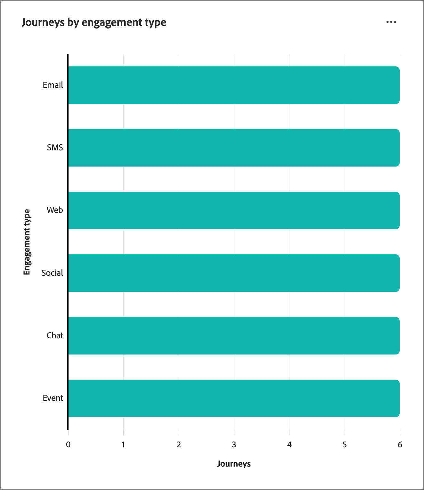

# Rekeningoverzicht - dashboard

Dit dashboard biedt een uitgebreid overzicht van uw actieve accountreizen, waarin de voortgang van uw account wordt beschreven aan de hand van cirkeldiagrammen en staafdiagrammen die voltooide accounts categoriseren en kwantificeren, en betrokkenheidsactiviteiten. Het helpt Marketers de doeltreffendheid van e-mail en de kanalen van SMS door zeer belangrijke levering en betrokkenheidsmetriek evalueren.

Dit overzicht is beschikbaar voor gepubliceerde accountreizen en het duurt ongeveer vier uur voordat gegevens de diagrammen en tabellen invullen.

{width="700" zoomable="yes"}

## Distributie van voltooiingssnelheden voor reizen

Dit diagram illustreert de verdeling van reizen op basis van hun voltooiingspercentage en wordt ingedeeld in vier verschillende scorereeksen. Het centrale cijfer vertegenwoordigt het totale aantal reizen en verstrekt een snelle momentopname van algemene vooruitgang. De gesegmenteerde kleuren geven het aandeel van reizen binnen elk scorebereik aan, zodat u de voltooiingstrends in één oogopslag kunt beoordelen.

Als u meer gedetailleerde informatie wilt weergeven, klikt u op het menupictogram **..** rechtsboven.

{width="500"}

## Reizen per betrokkenheidstype

Dit staafdiagram toont de verdeling van reizen op basis van het soort service en helpt u te bepalen welke overeenkomsten het meest werden gebruikt tijdens reizen. Elke staaf vertegenwoordigt een specifiek soort overeenkomst, waarvan de lengte het aantal reizen met activiteiten van dat type aangeeft. Deze visualisatie biedt een duidelijk en direct inzicht in de trends in uw betrokkenheid tijdens uw accountreizen.

Als u meer gedetailleerde informatie wilt weergeven, klikt u op het menupictogram **..** rechtsboven.

{width="500"}

## Betrokkenheid bij de gegevens

Als u gegevens wilt gebruiken, gebruikt u het menu **..** rechtsboven in elk diagram.

### [!UICONTROL Drill through]

Kies **[!UICONTROL Drill through]** voor een diepgaande analyse van de gegevens in het cirkeldiagram.

{width="700" zoomable="yes"}

U kunt _klikken Meer_ (**..**) menu bij top-right en kiezen **[!UICONTROL View more]** aan [&#x200B; mening uitgebreide gegevens &#x200B;](#view-more).

### [!UICONTROL View more]

Kies **[!UICONTROL View more]** om uitgebreide gegevens en inzichten weer te geven.

{width="700" zoomable="yes"}

Het weergegeven pop-upvenster bevat een diagram en een tabel met de uitsplitsing van de reisgegevens.

Als u de gegevens wilt downloaden, klikt u op **[!UICONTROL Download CSV]** rechtsboven in de datatabel. Om aan het _Overzicht_ dashboard terug te keren, klik **[!UICONTROL Close]**.
