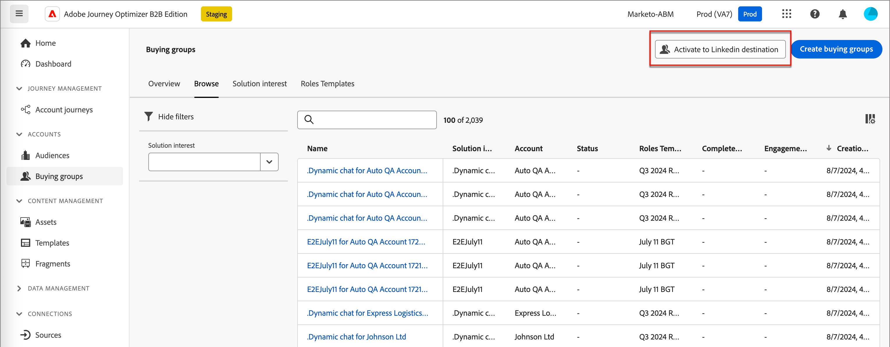

# Gekoppeld publiek voor account gekoppeld

Journey Optimizer B2B edition biedt de mogelijkheid om een publiek voor LinkedIn-advertenties te genereren via een publiek dat overeenkomt met een account en is ontworpen om u te helpen lege rollen in uw inkoopgroepen te vullen. Door een reeks het kopen groepsfilters te bepalen, kunt u een LinkedIn Gelijke Publiek aan doelvooruitzichten handhaven die uw het kopen groepsparameters aanpassen. Deze functie gebruikt Experience Platform Destination om bepaalde aspecten van de integratie te beheren. Er geldt een limiet van tien gegevensstromen.

Alvorens u een dataflow van Journey Optimizer B2B edition in werking stelt, moet u minstens één geval van [ (Bedrijven) LinkedIn Gelijke de bestemmingsschakelaar van de Publiek ](https://experienceleague.adobe.com/nl/docs/experience-platform/destinations/catalog/social/linkedin#connect) met een rekening hebben LinkedIn de Manager van de Campagne die in uw toepassing van Experience Platform wordt gevormd.

## Een nieuwe LinkedIn-accountverbinding configureren {#linkedin-destination-setup}

>[!CONTEXTUALHELP]
>id="ajo-b2b_linkedin_destination_setup"
>title="LinkedIn bestemmings opstelling wordt vereist"
>abstract="Verzend accounts die zijn gefilterd door groepen te kopen naar een LinkIn-bestemming om contact op te nemen met potentiële koopgroepsleden. U kunt maximaal 10 gegevensstromen voor 10 verschillende groepen gefilterde rekeningen tot stand brengen. Om met deze eigenschap te beginnen, voeg eerst een doel Linkedin toe."

1. Ga in Experience Platform naar **[!UICONTROL Connections]** > **[!UICONTROL Destinations]** in de linkernavigatie en selecteer de tab **[!UICONTROL Catalog]** .

1. Zoek in de catalogus de **[!UICONTROL (Companies) LinkedIn Matched Audience]** -connector.

   >[!TIP]
   >
   >U kunt de connector snel vinden door `LinkedIn` in te voeren in het zoekvak.

1. In de schakelaarkaart, klik _Meer_ (**..**) pictogram en kies **[!UICONTROL Configure new destination]**.

   {width="800" zoomable="yes"}

1. Selecteer **[!UICONTROL New Account]** en klik op **[!UICONTROL Connect to destination]** .

   {width="500"}

1. Geef uw LinkedIn-referenties op en meld u aan.

   Na authentificatie, wordt LinkedIn rekening verbonden als bestemming in Experience Platform.

   {width="400"}

   >[!IMPORTANT]
   >
   >Op dit punt, **ga** niet _[!UICONTROL Destination details]_&#x200B;in. Alleen de verbinding is nodig.

## Accountgegevens bijwerken

De naam en beschrijving van de LinkedIn-account zijn zichtbaar voor inkoopgroepen in Journey Optimizer B2B edition. Het is aan te raden deze gegevens bij te werken zodat ze gemakkelijk herkenbaar zijn voor kopers die met inkoopgroepen werken. U kunt de accountgegevens wijzigen in de gebruikersinterface van Experience Platform of Journey Optimizer B2B edition.

1. Ga naar **[!UICONTROL Connections]** > **[!UICONTROL Destinations]** in de linkernavigatie en selecteer de tab **[!UICONTROL Accounts]** .

1. Voor de nieuwe rekening die u creeerde, klik _Meer_ (**..**) menu en kies **[!UICONTROL Edit details]**.

   {width="800" zoomable="yes"} uit

1. Werk de naam en beschrijving bij in het dialoogvenster.

   {width="500"} uit

1. Klik op **[!UICONTROL Save]**.

## Account activeren voor kopersgroepen

>[!NOTE]
>
>Als u al tien gegevensstromen hebt, kunt u geen andere creëren. Als het maximumaantal wordt bereikt, verwijdert u er een uit Experience Platform voordat u een nieuwe maakt in Journey Optimizer B2B edition.

1. Ga in Journey Optimizer B2B edition naar **[!UICONTROL Accounts]** > **[!UICONTROL Buying groups]** in de linkernavigatie.

1. Selecteer de tab **[!UICONTROL Browse]** .

1. Klik op **[!UICONTROL Activate to LinkedIn Destination]** rechtsboven.

   {width="800" zoomable="yes"} uit

1. Geef de gegevensstroom een beschrijvende naam en beschrijving (optioneel).

   Nadat u het bewaart, wordt de naam die u voor dataflow specificeert prepended met _AJOB2B_ aan hulp in het identificeren van dataflow in Experience Platform.

1. Ga [ identiteitskaart van de Rekening van uw LinkedIn Rekening van de Manager van de Campagne ](https://www.linkedin.com/help/lms/answer/a424270) in.

   U kunt uw account-id vinden op basis van uw accountnaam in de gebruikersinterface van Campagnebeheer.

   {width="700" zoomable="yes"} toe

1. Klik op **[!UICONTROL Select buying group filters]** en definieer de parameters van het publiek van uw account.

   >[!IMPORTANT]
   >
   >Op dit moment kunnen filters niet worden bewerkt nadat de gegevensstroom is geactiveerd. Controleer uw werk voordat u de gegevensstroom activeert.

   {width="400"}

   Voor **[!UICONTROL Engagement score]** is de operator `Between` inclusief, evenals percentagebereiken. Bijvoorbeeld, zijn 5.1 en 5 zowel _tussen_ 5 en 6.

   Lege voorwaarden worden behandeld als `Is Any` .

   Klik op **[!UICONTROL Save]** om de opgegeven filters toe te voegen.

1. Klik **[!UICONTROL Select LinkedIn destination]** en kies de gevormde bestemming LinkedIn die u wilt gebruiken.

   Op activering, leidt dit het plaatsen tot dataflow gebruikend de bestemmingsconfiguratie en een overeenkomstig virtueel segment.

1. Controleer de instellingen en klik op **[!UICONTROL Activate]** rechtsboven.

   Klik nogmaals op **[!UICONTROL Activate]** in het bevestigingsdialoogvenster.

   Er wordt een banner weergegeven met een koppeling naar het menu met gegevensstromen in Experience Platform, zodat u de gegevensstroomrecord kunt controleren.

## Betaalde betrokkenheid bij media ordenen

U kunt via een betaald mediakanaal, zoals LinkedIn Addiences, contact opnemen met accountleden om hen aan te schaffen, te voeden en in aanmerking te laten komen voor Verkoop. Gebruik a _neemt een 1&rbrace; knoop van de actie &lbrace;in een rekeningsreis om overeenkomst met zeer belangrijke leden van een rekening door een extern kanaal te automatiseren dat best voor verschillende rekeningsleden past._

>[!VIDEO](https://video.tv.adobe.com/v/3448649/?learn=on)