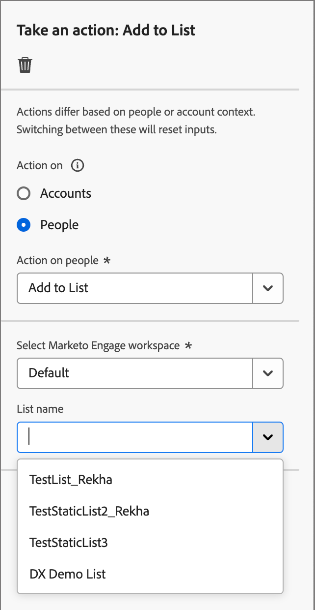

# Handeling uitvoeren

In uw accountreis kunt u een _[!UICONTROL Take an action]_-knooppunt toevoegen om een handeling uit te voeren, zoals een e-mail verzenden, een score wijzigen, toewijzen aan een inkoopgroep, enzovoort. Handelingen zijn doorgaans de handelingen die u wilt uitvoeren als gevolg van een of andere trigger, zoals een gebeurtenis of een vorige handeling.

{width="30"} [&#x200B; bekijk de overzichtsvideo &#x200B;](#overview-video)

## Accountacties

Gebruik een handeling op accounts wanneer u een wijziging wilt toepassen op alle personen die deel uitmaken van accounts op het knooppuntpad.

### Handelingen en beperkingen {#account-action-constraints}

| Handeling | Restricties |
| ------ | ----------- |
| [!UICONTROL Account Change Data Value] | Selecteer attribuut   Nieuwe waarde |
| [!UICONTROL Account Interesting Moment] | Het type (e-mail, mijlpaal, of Web)   Beschrijving (facultatief) |
| [!UICONTROL Activate to destination] | Een doel selecteren |
| [!UICONTROL Add Account to (other) Journey] | Reis voor live account selecteren |
| [!UICONTROL Add to account list] | Lijst met live statische accounts selecteren |
| [!UICONTROL Remove Account from Journey] | Reis voor live account selecteren |
| [!UICONTROL Remove from account list] | Een lijst met live statische accounts selecteren |
| [!UICONTROL Send Sales Alert] | Selecteer oplossingsrente   verzendt e-mail naar |
| [!UICONTROL Update Buying Group Stage] | Selecteer oplossingsrente   Uitgezochte het kopen groepsstadium |
| [!UICONTROL Update Buying Group Status] | Selecteer oplossingsrente   Status (vereist, maximaal 50 karakters) |

### Een op een account gebaseerde actie toevoegen

1. Navigeer naar de reiskaart.

1. Klik op de plusknop ( **+** ) op een pad en kies **[!UICONTROL Take an action]** .

   {width="400"}

1. In de knoopeigenschappen op het recht, kies **[!UICONTROL Accounts]** voor de actie.

1. Selecteer een actie in de lijst en stel de waarden voor de actie in.

   {width="700" zoomable="yes"}

## Handelingen Personen

Gebruik een handeling op personen wanneer u een wijziging wilt toepassen op alle personen op het knooppad. Dit knooppunttype kan binnen de gespleten weg door mensen worden gebruikt of weg door rekeningen verdelen.

### Handelingen en beperkingen {#people-action-constraints}

| Context | Handeling | Restricties |
| ------- | ------ | ----------- |
| [&#x200B; Journey Optimizer B2B &#x200B;](#journey-optimizer-b2b-actions) | [!UICONTROL Add to external customer audience] | Externe klantgroep selecteren |
| | [!UICONTROL Assign to Buying Group] | Selecteer oplossingsrente   Uitgezochte rol |
| | [!UICONTROL Change Data Value] | Selecteer persoonattributen   plaatsen nieuwe waarde |
| | [!UICONTROL Change Score] | Score naam   Verandering in score |
| | [!UICONTROL Person Interesting Moment] | Type   Beschrijving |
| | [!UICONTROL Remove from Buying Group] | Belang van oplossing selecteren |
| | [!UICONTROL Send email] | Creeer nieuwe e-mail   Uitgezochte e-mail van Marketo Engage |
| | [!UICONTROL Send SMS] | SMS maken |
| [&#x200B; Marketo Engage &#x200B;](#marketo-engage-actions) | [!UICONTROL Add to List] | Selecteer de werkruimte van Marketo Engage   Naam van de Lijst |
| | [!UICONTROL Add to Marketo Engage Request campaign] | Selecteer de werkruimte van Marketo Engage   Uitgezochte campagne van het Verzoek |
| | [!UICONTROL Change People Partition in Marketo Engage] | Nieuwe partitie |
| | [!UICONTROL Remove from List] | Selecteer de werkruimte van Marketo Engage   Naam van de Lijst |

### Een op personen gebaseerde actie toevoegen

1. Navigeer naar de reiskaart.

1. Klik op de plusknop ( **+** ) op een pad en kies **[!UICONTROL Take an action]** .

1. In de knoopeigenschappen op het recht, kies **[!UICONTROL People]** voor de actie.

1. Selecteer een actie in de lijst en stel de waarden voor de actie in.

{width="700" zoomable="yes"}

### Journey Optimizer B2B-acties

De op mensen-gebaseerde acties van Journey Optimizer B2B worden ontworpen om mededelingen door de gevormde kanalen te beheren en mensen te beheren categoriseren binnen uw het kopen groepen en rekeningen. De reis past de actie toe wanneer een kwalificerende rekening met persoonprofielen de knoop bereikt.

+++[!UICONTROL Add to external customer audience]

Met deze actie kunt u mensen naar een extern publiek duwen dat via een betaald mediakanaal kan worden geactiveerd om leden van inkoopgroepen nog meer doelwit te maken. Deze handeling wordt uitgevoerd via Real-Time CDP B2B/P Edition.

>[!NOTE]
>
>Wanneer een kwalificerende rekening met persoonprofielen _toevoegt aan de externe knoop van het klantenpubliek_ in een gepubliceerde reis, kan het tot 48 uren voor die profielen vergen om in het externe publiek te bevolken.

{width="300"}

Wanneer u deze op personen gebaseerde actie selecteert, kunt u een nieuw extern publiek maken of een bestaand extern publiek selecteren. Voor bestaande doelgroepen kunt u kiezen uit externe klantgroepen die alleen in Journey Optimizer B2B edition zijn gemaakt. Wanneer u een publiek creeert en het voor deze reisactie gebruikt, zorg ervoor dat u de bestemming verbindt. Voor meer informatie, zie [&#x200B; een nieuwe bestemmingsverbinding &#x200B;](https://experienceleague.adobe.com/nl/docs/experience-platform/destinations/ui/connect-destination){target="_blank"} en [&#x200B; Overzicht van de Activering &#x200B;](https://experienceleague.adobe.com/nl/docs/experience-platform/destinations/ui/activate/activation-overview#activate-audiences-from-the-destinations-catalog){target="_blank"} in de documentatie van Experience Platform creëren.

{width="30"} [&#x200B; bekijk een videooverzicht voor betaalde media orchestratie &#x200B;](../data/linkedin-account-matched-audiences.md#orchestrate-paid-media-engagement)

_Om een extern publiek tot stand te brengen :_

1. Kies **[!UICONTROL Create new]** .

1. Klik op **[!UICONTROL Create external customer audience]**.

1. Voer een **[!UICONTROL Name]** (vereist) en **[!UICONTROL Description]** (optioneel) in voor het nieuwe externe publiek.

   {width="300"}

1. Klik op **[!UICONTROL Create]**.

   Het systeem maakt het nieuwe publiek en geeft een bevestigingsbericht weer. Vervolgens kunt u doorgaan en het gebruiken als een bestaand publiek voor de actie node.

   >[!NOTE]
   >
   >Wanneer een nieuw extern klantenpubliek van Journey Optimizer B2B edition wordt gecreeerd, wordt het gezeten met een dummyverslag (`test@email.com`). Deze record wordt overschreven zodra het eerste echte profiel vanaf de reis aan het externe publiek wordt toegevoegd.

_Een bestaand publiek gebruiken :_

1. Klik op **[!UICONTROL Select external customer audience]**.

1. Selecteer in het dialoogvenster het publiek dat u wilt gebruiken.

   {width="700" zoomable="yes"} toe

1. Klik op **[!UICONTROL Add audience]**.

+++

+++[!UICONTROL Assign to Buying Group]

Gebruik deze actie om personenprofielen aan a [&#x200B; toe te voegen die groep &#x200B;](../buying-groups/buying-groups-overview.md) kopen op een geselecteerde oplossingsrente en een rol wordt gebaseerd.

{width="300"}

+++

+++[!UICONTROL Change Data Value]

Gebruik deze actie om de waarde van de attributen van het a [&#x200B; personenprofiel &#x200B;](../data/field-mapping.md#xdm-business-person-attributes) te veranderen. Selecteer het kenmerk en stel de nieuwe waarde in.

{width="300"}

+++

+++[!UICONTROL Change Score]

Gebruik deze handeling om de score voor personen in Marketo Engage te wijzigen. [Meer informatie](https://experienceleague.adobe.com/nl/docs/marketo-learn/tutorials/lead-and-data-management/lead-scoring-learn){target="_blank"}

{width="300"}

+++

+++[!UICONTROL Person Interesting Moment]

Gebruik deze handeling om een interessant moment voor mensen vast te leggen. Kies een type (E-mail, Mijlpaal, of Web) en voeg een beschrijving (facultatief) toe.

{width="300"}

+++

+++[!UICONTROL Remove from Buying Group]

Gebruik deze actie om personenprofielen uit a [&#x200B; te verwijderen die groep &#x200B;](../buying-groups/buying-groups-overview.md) kopen op een geselecteerde oplossingsrente wordt gebaseerd.

{width="300"}

+++

+++[!UICONTROL Send email]

Gebruik deze handeling om een e-mail te verzenden. Nadat u [&#x200B; e-mail &#x200B;](../content/add-email.md#add-an-email-to-your-journey) voor de knoop creeert, kunt u, e-mailberichten in de e-mailontwerpruimte ontwerpen personaliseren en voorproef (zie [&#x200B; E-mail authoring &#x200B;](../content/email-authoring.md)). U kunt ook een [&#x200B; e-mail van Marketo Engage &#x200B;](https://experienceleague.adobe.com/nl/docs/marketo/using/product-docs/email-marketing/general/creating-an-email/create-an-email){target="_blank"} verzenden. Selecteer de Marketo Engage-werkruimte en selecteer vervolgens het e-mailbericht dat u wilt verzenden.

{width="300"}

+++

+++[!UICONTROL Send SMS]

Gebruik deze actie om een SMS-bericht te verzenden. U kunt tot stand brengen, personaliseren, en voorproefSMS berichten in de visuele ontwerpruimte (zie [&#x200B; het auteursrecht van SMS &#x200B;](../content/sms-authoring.md)).

{width="300"}

+++

### Marketo Engage-acties

De Marketo Engage-acties op basis van personen zijn ontworpen om uw marketingorganisatie op basis van account in Journey Optimizer B2B edition te coördineren met uw marketingactiviteiten op basis van leads in Marketo Engage. Gebruik deze acties om lijstlidmaatschap, personenverdelingen, en verzoekcampagnes te ordenen.

+++[!UICONTROL Add to list]

Gebruik deze actie om mensen aan a [&#x200B; Statische Lijst &#x200B;](https://experienceleague.adobe.com/nl/docs/marketo/using/product-docs/core-marketo-concepts/smart-lists-and-static-lists/static-lists/understanding-static-lists){target="_blank"} in Marketo Engage toe te voegen.

Selecteer eerst de werkruimte in de verbonden Marketo Engage-instantie. Selecteer vervolgens de lijstnaam.

{width="300"}

+++

+++[!UICONTROL Add to Marketo Request campaign]

Gebruik deze actie om personenprofielen aan de campagne van het a [&#x200B; verzoek &#x200B;](https://experienceleague.adobe.com/nl/docs/marketo/using/product-docs/core-marketo-concepts/smart-campaigns/flow-actions/request-campaign){target="_blank"} in Marketo Engage toe te voegen.

Selecteer eerst de werkruimte in de verbonden Marketo Engage-instantie. Selecteer vervolgens de naam van de aanvraagcampagne.

{width="300"}

+++

+++[!UICONTROL Change people partition in Marketo Engage]

Gebruik deze actie om de [&#x200B; persoonverdeling &#x200B;](https://experienceleague.adobe.com/nl/docs/marketo/using/product-docs/administration/workspaces-and-person-partitions/understanding-workspaces-and-person-partitions#person-partitions){target="_blank"} in Marketo Engage te veranderen.

{width="300"}

+++

+++[!UICONTROL Remove from list]

Gebruik deze actie om mensen uit a [&#x200B; Statische Lijst &#x200B;](https://experienceleague.adobe.com/nl/docs/marketo/using/product-docs/core-marketo-concepts/smart-lists-and-static-lists/static-lists/understanding-static-lists){target="_blank"} in Marketo Engage te verwijderen. Selecteer eerst de werkruimte in de verbonden Marketo Engage-instantie. Selecteer vervolgens de lijstnaam.

{width="300"}

Als het profiel van de persoon geen lid was van de slimme lijst, wordt de actie genegeerd.

+++

## Video over overzicht

>[!VIDEO](https://video.tv.adobe.com/v/3443207/?learn=on)
