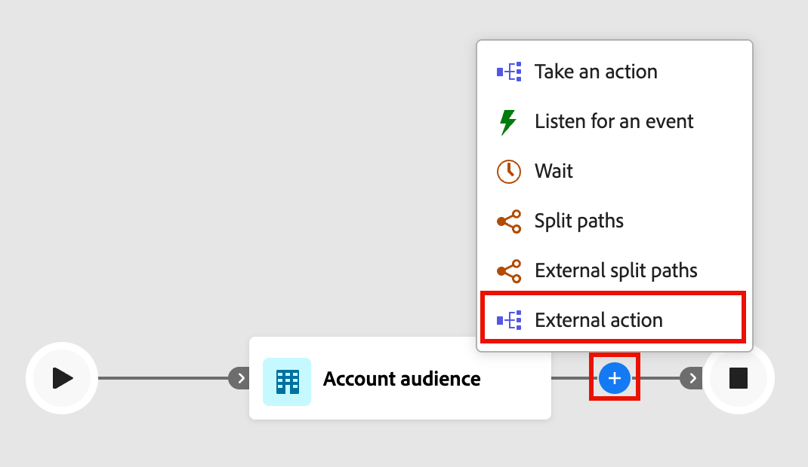

# Externe knooppunten

Gebruik externe knooppunten om de reis van uw account te verbinden met een externe service. Wanneer een accountpubliek een van deze knooppunten bereikt, verzendt Journey Optimizer B2B edition asynchroon gegevens van publiekskenmerken naar de externe service. De dienst verwerkt de gegevens en antwoordt gebruikend callback, terugkerende publieksinformatie en meta-gegevens die de reis gebruikt om verder te gaan.

>[!NOTE]
>
>Externe actieknooppunten zijn alleen beschikbaar tijdens reizen naar de account. Ze worden niet ondersteund op persoonlijke reizen.
>
>Een beheerder moet [&#x200B; vormen en de externe actie &#x200B;](../admin/configure-external-actions.md) activeren alvorens de marketers deze knopen in een reis toevoegen en uitvoeren.

Er zijn twee typen externe actieknooppunten:

* **[Externe actie](#external-action)** - roept de externe dienst en gaat langs één enkele uitgaande weg verder. Gebruik dit knooppunt wanneer u een extern proces wilt activeren zonder vertakkende logica, zoals het bijwerken van een record in een extern systeem of het verzenden van een signaal naar een downstream-service.
* **[Externe gespleten wegen](#external-split-paths)** - roept de externe dienst en evalueert de reactie op routerekeningen langs één van verscheidene bepaalde wegen. Gebruik deze knoop wanneer de externe dienst een waarde, zoals een score, een rij, of een classificatie terugkeert, die de volgende stap in de reis bepaalt.

## Externe actieknooppunt {#external-action}

De _Externe actie_ knoop roept de externe dienst en gaat langs één enkele uitgaande weg, ongeacht de reactieinhoud voort. Gebruik het voor integraties waar geen vertakking na de externe vraag nodig is.

1. Navigeer naar het reisoverzicht van de account.

1. Klik op de plusknop ( **+** ) op een pad en kies **[!UICONTROL External action]** .

   {width="400"} toe

1. In de knoopeigenschappen op het recht, plaats de **[!UICONTROL Action on]** context voor de externe actie:

   * Kies **[!UICONTROL Accounts]** wanneer u de externe handeling wilt toepassen op alle personen die deel uitmaken van accounts op het knooppuntpad.
   * Kies **[!UICONTROL People]** wanneer u een wijziging wilt toepassen op alle personen op het knooppad.

1. Selecteer de externe **[!UICONTROL Service name]** .

   {width="600" zoomable="yes"}

   De lijst omvat alle gevormde externe acties die actief zijn en voor het _Externe actietype_ en de context worden aangewezen.

1. Als de service algemene kenmerken heeft, voert u de vereiste waarden in in de velden die onder de servicenaam worden weergegeven.

1. Blijf de reis van de uitgaande wegen van de knoop bouwen.

   Het pad _[!UICONTROL Timeout or error]_&#x200B;wordt automatisch gemaakt. Als de onderbrekingsperiode (zoals die in de dienst wordt gevormd) verstrijkt alvorens een reactie wordt ontvangen, vordert de rekening of de persoon onderaan deze weg. Het is hetzelfde als er een foutreactie wordt ontvangen. U kunt reisknopen aan deze weg toevoegen om deze scenario&#39;s, of de reiseinden voor het publiekslid te behandelen.

## Knooppunt Externe gesplitste paden {#external-split-paths}

De Externe gespleten wegknoop roept de externe dienst en gebruikt de reactie om te bepalen welke wegrekeningen volgende nemen. Elk pad wordt gedefinieerd door een voorwaarde op basis van een variabele (accessor) die door de externe service wordt geretourneerd. De reis evalueert de reactie tegen de bepaalde wegvoorwaarden en leidt elke rekening langs de eerste passende weg. De padvoorwaarden worden in de bovenste volgorde geëvalueerd. Elke account gaat verder langs het eerste pad waarvan de voorwaarde overeenkomt met de waarde die door de externe service wordt geretourneerd.

1. Navigeer naar het reisoverzicht van de account.

1. Klik op de plusknop ( **+** ) op een pad en kies **[!UICONTROL External split paths]** .

   {width="400"} toe

1. Kies een **[!UICONTROL Split paths by]** type in de knoopeigenschappen aan de rechterkant:

   * **[!UICONTROL Accounts]** - Voor gesplitste paden op basis van accounts kunt u zowel account- als personenknooppunten toevoegen binnen de gedefinieerde paden.
   * **[!UICONTROL People]** - Voor gesplitste paden op personen kunt u alleen actieknoppen voor personen toevoegen binnen de gedefinieerde paden. Een splitsing op basis van personen wordt automatisch gesloten met een knooppunt _[!UICONTROL Merge paths]_, zodat alle personen de volgende stap kunnen uitvoeren zonder hun accountcontext te verliezen.

1. Selecteer de **[!UICONTROL Service name]** .

1. Als de de dienstconfiguratie _globale attributen_ heeft, ga de vereiste waarden op de gebieden in die onder de de dienstnaam verschijnen.

1. Definieer voor _[!UICONTROL Path 1]_&#x200B;de vertakkingsvoorwaarde:

   * Vervang voor **[!UICONTROL Label]** de standaardwaarde door een beschrijvend label.
   * Kies bij **[!UICONTROL Select variable]** een accessor. Accessors zijn waarden die door de externe service worden geretourneerd en worden gedefinieerd wanneer de handeling wordt geconfigureerd.
   * Kies bij **[!UICONTROL Select operator]** de operator.
   * Voer bij **[!UICONTROL Enter values]** de waarde in die moet worden vergeleken met.

   {width="600" zoomable="yes"}

   >[!NOTE]
   >
   >De beschikbare voorwaardenvariabelen en gesteunde reiscontext (_Rekening_, _Mensen_, of _Mensen in Rekening_) worden bepaald door de externe actieconfiguratie. Neem contact op met de beheerder als de verwachte service of variabelen niet beschikbaar zijn.

1. Als u meer paden wilt toevoegen, klikt u op **[!UICONTROL Add path]** en definieert u een voorwaarde voor elk pad dat u nodig hebt.

1. Ga door met het bouwen van de reis vanaf elk uitgaand pad van het knooppunt.

   Het pad _[!UICONTROL Timeout or error]_&#x200B;wordt automatisch gemaakt. Als de onderbrekingsperiode (zoals die in de dienst wordt gevormd) verstrijkt alvorens een reactie wordt ontvangen, vordert de rekening of de persoon onderaan deze weg. Het is hetzelfde als er een foutreactie wordt ontvangen. U kunt reisknopen aan deze weg toevoegen om deze scenario&#39;s, of de reiseinden voor het publiekslid te behandelen.

1. Voor _Gesplitst door rekeningen_, kunt u de knoop van de wegen van de a [&#x200B; Fusie &#x200B;](./split-merge-paths-nodes.md#merge-paths) toevoegen om twee of meer wegen te combineren zoals nodig.
