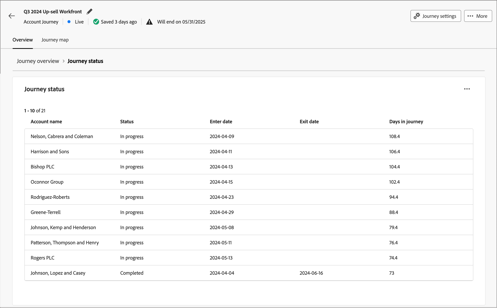

# Reisgegevens

Wanneer u op de naam van een actieve accountreis klikt, worden de reisgegevens weergegeven. Het tabblad _[!UICONTROL Overview]_&#x200B;bevat nuttige informatie over de rit, waaronder algemene AI-overzichten.

Dit dashboard biedt een uitgebreid overzicht van een geselecteerde accountreis, met een gedetailleerd overzicht van de voortgang van de account aan de hand van cirkel- en lijndiagrammen die voltooide accounts categoriseren en kwantificeren, lopende activiteiten en afbrekingen in de loop van de tijd. Het helpt Marketers de doeltreffendheid van e-mail en de kanalen van SMS door zeer belangrijke levering en betrokkenheidsmetriek evalueren.

Dit overzicht is beschikbaar voor gepubliceerde accountreizen en het duurt ongeveer vier uur voordat gegevens de diagrammen en tabellen invullen.

{width="700" zoomable="yes"}

## Reisvoltooiing

Deze sectie bevat twee voltooiingsmetriek:

* **[!UICONTROL Journey status]** - Dit cirkeldiagram biedt een verdeling van reisstatussen door rekeningen in _Voltooid_ aan te categoriseren, _Bezig_, en _Geaborteerd_. Elk segment wordt geëtiketteerd met overeenkomstige percentages en rekeningsaantallen op de buitenrand van de grafiek.
* **[!UICONTROL Journey completion over time]** - Dit lijndiagram volgt het aantal accounts dat hun reis in de loop van de tijd heeft voltooid. De horizontale as wijst de tijdlijn toe terwijl de verticale as de rekeningen kwantificeert, die een duidelijke mening van voltooiingstrends verstrekken.

## Journalistiek

Deze sectie bevat twee voltooiingsmetriek:

* **[!UICONTROL Engagement by accounts]** - Dit cirkeldiagram segmenteert de rekeningen in een reis in _Betrokken_ en _niet bezeten_ categorieën. Het centrale cijfer toont het totale aantal. Deze visualisatie biedt in één oogopslag inzicht in de totale betrokkenheid van uw account.
* **Betrokkenheid door mensen** - Deze visualisatie toont het totale aantal mensen die als _worden gekwalificeerd geëngageerd_ in een reis.

## Reisprestaties

In deze sectie worden twee belangrijke meetgegevens beschreven:

* **[!UICONTROL Journey completion rate]** - Het percentage accounts waarmee de rit is voltooid.
* **[!UICONTROL Journey duration]** - De gemiddelde tijdsduur voor accounts om hun reis te voltooien.

## E-mail- en sms-prestaties

De prestatietabellen verstrekken een gedetailleerd overzicht van de doeltreffendheid van e-mail en SMS kanalen. Elke lijst toont metriek, zoals leveringstarieven en klikthrough tarieven, die u helpen het effect van elk communicatie aanraakpunt beoordelen.

**[!UICONTROL Email performance]** tabelkolommen:

* _[!UICONTROL Asset name]_- naam van het element
* _[!UICONTROL Sent]_- aantal verzonden e-mailberichten
* _[!UICONTROL Delivery rate]_- aantal geleverde e-mails gedeeld door het verzonden aantal
* _[!UICONTROL Open Rate]_- nummer geopende e-mailberichten gedeeld door het geleverde nummer
* _[!UICONTROL Click-through rate]_- aantal geklikte e-mails gedeeld door het geleverde aantal

**[!UICONTROL SMS performance]** tabelkolommen:

* _[!UICONTROL Asset name]_- naam van het element
* _[!UICONTROL Sent]_- aantal verzonden SMS-berichten
* _[!UICONTROL Delivery rate]_- aantal geleverde SMS-berichten gedeeld door het verzonden nummer
* _[!UICONTROL Click-through rate]_- aantal aangeklikte SMS-berichten gedeeld door het geleverde aantal
<!-- 
To generate a shareable PDF of your current view, click **[!UICONTROL Export]** at the top right of the page. -->

## Verbeterde interactie

Bouw verder met de gegevens door het actiepictogram (**...**) in het hoogste recht van elke grafiek of lijst te gebruiken.

### Doorboor

Kies voor het _[!UICONTROL Journey status]_-diagram **[!UICONTROL Drill through]**&#x200B;voor een diepgaande analyse van de status van afzonderlijke accounts.

{width="600" zoomable="yes"}
<!--
The applied global filters are carried over to the view and displayed at the top. Click the _Filter_ icon at the top left to filter the data display by journey.-->

### Meer weergeven

Kies **[!UICONTROL View more]** voor toegang tot uitgebreide gegevens. Het weergegeven pop-upvenster bevat een uitsplitsing van de gegevens.

{width="600" zoomable="yes"}

Als u de gegevens wilt downloaden, klikt u op **[!UICONTROL Download CSV]** rechtsboven in de datatabel. Om aan het _Overzicht_ dashboard terug te keren, klik **[!UICONTROL Close]**.
