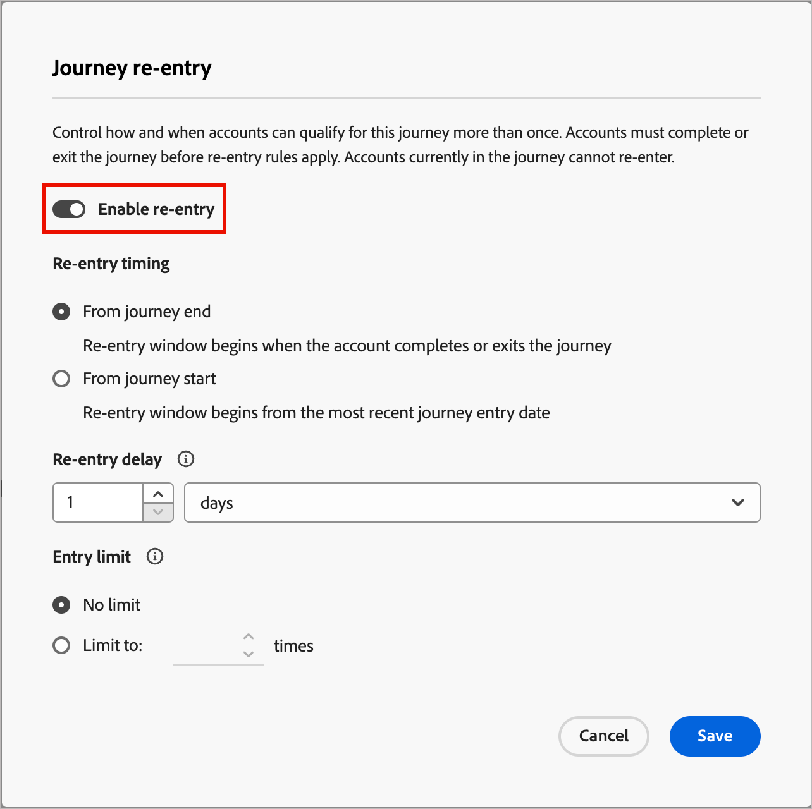

# Reisreis

_slechts reizen van de Rekening_

Wanneer u re-entry voor een rekeningsreis toelaat, kunt u controleren wanneer en hoe vaak een rekening de zelfde reis kan opnieuw ingaan. Gebruik de instellingen voor opnieuw invoeren om criteria, beperkingen en wachttijden in te stellen, zodat accounts op een gecontroleerde manier herkwalificeren voor de reis.

Een account kan zich kwalificeren voor een reis wanneer de volgende items waar zijn:

* De rekening is binnen het aantal toegelaten re-ingangen voor de reis.
* Het account heeft de wachttijddrempel bereikt (de minimale wachttijd voordat het account wordt geherkwalificeerd).
* Het account is momenteel niet op reis.

## Opnieuw betreden van een accountreis inschakelen

U kunt re-ingang toelaten en re-entry montages veranderen wanneer de reis in a _de status van het Ontwerp_ is.

1. Open de conceptrekeningreis.

1. Klik op het menu **[!UICONTROL More...]** rechtsboven en kies **[!UICONTROL Re-entry]** .

   {width="450"}

1. Schakel de optie _[!UICONTROL Journey re-entry]_in het dialoogvenster **[!UICONTROL Enable re-entry]**in.

   Wanneer de functie is ingeschakeld, worden de opties voor timing, vertraging en limieten weergegeven.

   {width="450"}

1. Kies bij **[!UICONTROL Re-entry timing]** hoe de wachttijd wordt berekend:

   * **[!UICONTROL Wait from end of journey]** - De wachttijd begint wanneer de account wordt afgesloten of de rit wordt voltooid. Bijvoorbeeld: &quot;30 dagen nadat de account de reis heeft voltooid, kunnen ze opnieuw worden ingevoerd.&quot;

   * **[!UICONTROL Wait from start of journey]** - De wachttijd is gebaseerd op het tijdstip waarop de account de eerste rit is gestart. Bijvoorbeeld: &quot;30 dagen vanaf het moment dat de account de reis begon, kunnen ze opnieuw binnenkomen.&quot;

1. Stel de waarde **[!UICONTROL Re-entry delay]** in. Dit is de wachttijd in uren of dagen.

   Deze instelling bepaalt hoe lang een account moet wachten nadat een account is afgesloten of de rit is gestart voordat deze opnieuw kan worden geopend.

1. Stel de waarde in **[!UICONTROL Entry limit]** in om de maximale tijd te bepalen waarop een account de reis mag betreden.

   Wanneer een rekening de grens bereikt, komt het niet meer voor toegang in aanmerking tot de grens wordt opnieuw ingesteld of de reis met een nieuwe grens wordt gepubliceerd.

   Deze limiet geldt per rekening voor die reis.

1. Klik op **[!UICONTROL Save]**.

## Voortgang en activiteit van account

Voor een gepubliceerde rekeningsreis, toont de de rekeningsvooruitgang [ van de wegenkaart ](./journeys-overview.md#review-account-progression) voor de wegknopen. Elk knooppunt op de kaart geeft het aantal accounts weer dat dat knooppunt moet bereiken en, voor live reizen, het aantal accounts dat zich momenteel op dat knooppunt bevindt. Telkens wanneer een rekening een reis opnieuw ingaat, telt het als een afzonderlijke ingang.
<!-- You can see how many times accounts have entered the journey. ?? -->

Wanneer u binnen aan [ rekeningsdetails ](../accounts/account-details.md) boor, toont de rekeningsactiviteit telkens als de rekening de reis inging. Het omvat expliciete activiteit en een herhalingstelling zodat u re-ingangen duidelijk kunt zien.
