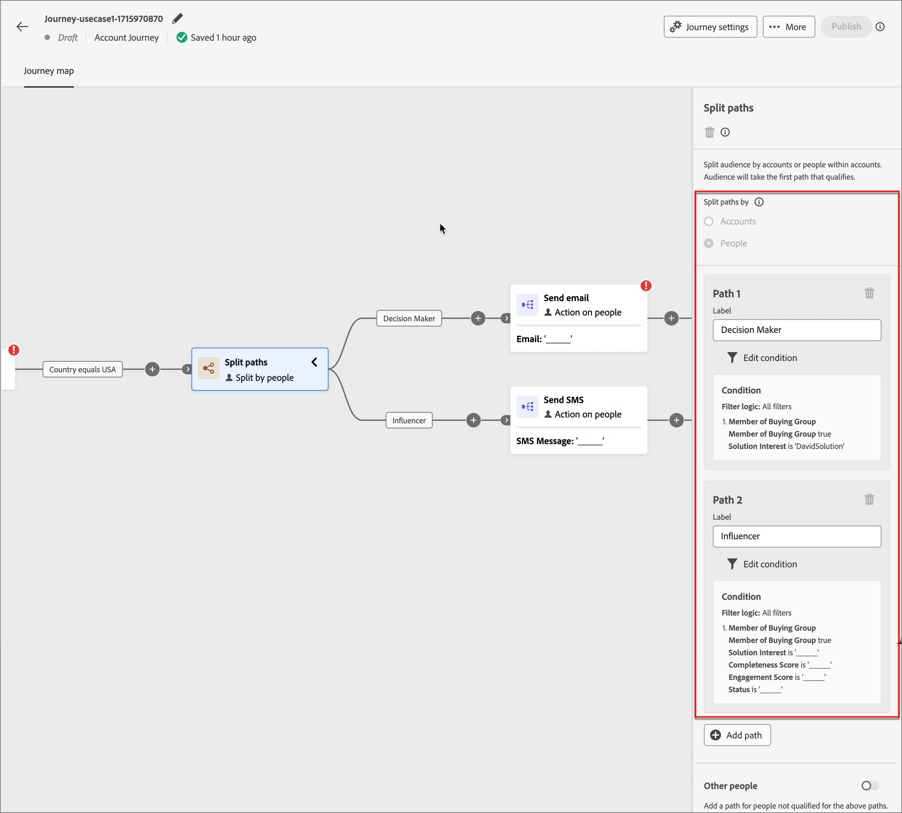
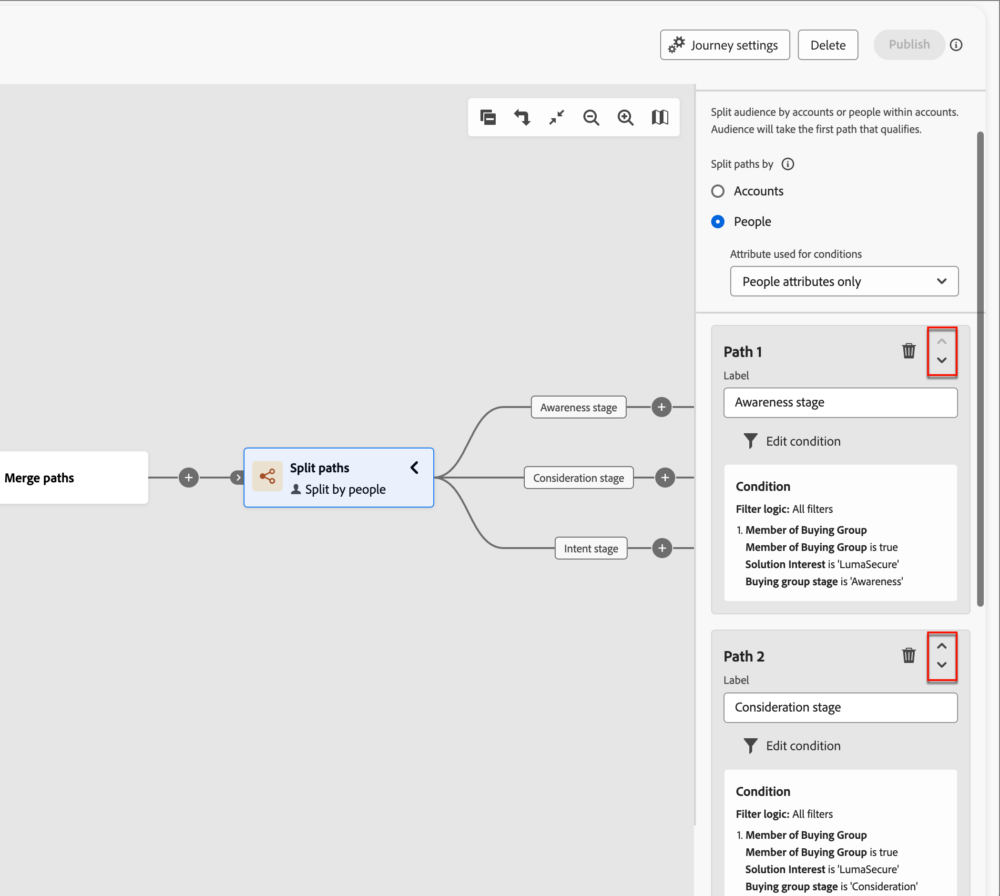

# Paden splitsen en samenvoegen

Gebruik knooppunten voor splitsen en samenvoegen in uw accountreis om uw accountreizen te ordenen. U kunt het publiek segmenteren volgens voorwaarden die u definieert en de segmenten combineert om door te gaan.

{width="30"} [ bekijk de overzichtsvideo ](#overview-video)

## Paden splitsen

Voeg a _Gesplitste wegen_ knoop toe om één of meerdere gesegmenteerde die wegen te bepalen op rekening of personenattributen worden gebaseerd.

>[!NOTE]
>
>Er worden maximaal 25 paden ondersteund.

**Gesplitste wegen door rekeningen**: De wegen die door rekeningen worden gesplitst kunnen zowel rekening als menselijke acties en gebeurtenissen omvatten. Deze paden kunnen verder worden gesplitst.

_hoe werkt een gespleten weg door rekeningsknoop?_

* Elk pad dat u toevoegt, bevat een eindknooppunt met de mogelijkheid om knooppunten aan elke rand toe te voegen.
* Splitsen op accountknooppunten kan worden genest. U kunt het pad herhaaldelijk splitsen op accounts.
* Evalueert paden van boven naar beneden. Als een account overeenkomt met het eerste en tweede pad, gaat deze alleen door langs het eerste pad.
* Twee of meer paden kunnen worden gecombineerd met een samenvoegknooppunt.
* Ondersteunt de definitie van een _[!UICONTROL Other accounts]_-pad, waar u handelingen of gebeurtenissen kunt toevoegen voor accounts die niet overeenkomen met een van de gedefinieerde segmenten/paden.

{width="700" zoomable="yes"}

**Gesplitste wegen door mensen**: De wegen die door mensen worden gesplitst en kunnen slechts personenacties omvatten. Deze paden kunnen niet opnieuw worden gesplitst en automatisch met elkaar worden verbonden.

_hoe werkt een gespleten weg door mensen knoop?_

* Functies binnen a _gegroepeerde knoop_ spleet-fusie combinatie. De gesplitste paden worden automatisch samengevoegd, zodat alle mensen in het publiek verder kunnen gaan naar de volgende stap zonder hun accountcontext te verliezen.
* Splitsen op basis van knooppunten kan niet worden genest. U kunt geen gesplitst pad toevoegen voor personen op een pad dat zich in dit gegroepeerde knooppunt bevindt.
* Evalueert paden van boven naar beneden. Als een persoon overeenkomt met het eerste en tweede pad, gaat hij alleen verder langs het eerste pad.
* Steunt het gebruik van _rekening-persoon verhoudingen_, die u toestaat om mensen te filtreren die op hun rol (zoals contractant of voltijdwerknemer) worden gebaseerd zoals die in de rolmalplaatjes wordt bepaald.
* Ondersteunt de definitie van een _[!UICONTROL Other people]_-pad, waar u handelingen of gebeurtenissen kunt toevoegen voor personen die niet overeenkomen met een van de gedefinieerde segmenten/paden.

{width="700" zoomable="yes"}

### Padvoorwaarden {#path-conditions}

| Knooppuntcontext | Padvoorwaarden | Beschrijving |
| ------------ | --------------- | ----------- |
| [ Rekeningen ](#add-a-split-path-by-account-node) | Accountkenmerken | Attributen van het accountprofiel, waaronder: <li>Jaarlijkse ontvangsten</li><li>Stad</li><li>Land</li><li>Werknemersgrootte</li><li>Marktsegment</li><li>Naam</li><li>SIC-code</li><li>Staat</li> |
| | [!UICONTROL Special filters] > [!UICONTROL Has Buying Group] | Op de rekening worden leden van inkoopgroepen al dan niet beoordeeld aan de hand van een of meer van de volgende criteria: <li>Belang van oplossing</li><li>Status van kopersgroep</li><li>Complete score</li><li>Engagement Score</li> |
| [ Mensen ](#add-a-split-path-by-people-node) > [!UICONTROL People attributes only] | [!UICONTROL Person Attributes] | Attributen van het profiel van de persoon, met inbegrip van: <li>Stad</li><li>Land</li><li>Geboortedatum</li><li>E-mailadres</li><li>E-mail is ongeldig</li><li>E-mail is geschorst</li><li>Voornaam</li><li>Overgenomen deelstaatgebied</li><li>Functie</li><li>Achternaam</li><li>Mobiel telefoonnummer</li><li>Telefoonnummer</li><li>Postcode</li><li>Staat</li><li>Niet geabonneerd</li><li>Reden waarop geen abonnement is genomen</li> |
| | [!UICONTROL Activity history] > [!UICONTROL Email] | E-mailactiviteiten in verband met de reis: <li>[!UICONTROL Clicked link in email]</li><li>Geopende e-mail</li><li>Is per e-mail verzonden</li><li>Is per e-mail verzonden</li> Deze voorwaarden worden geëvalueerd aan de hand van een geselecteerd e-mailbericht uit een eerdere reis. |
| | [!UICONTROL Activity history] > [!UICONTROL Data Value Changed] | Voor een geselecteerd persoonkenmerk is een waardewijziging opgetreden. Deze wijzigingstypen zijn onder meer: <li>Nieuwe waarde</li><li>Vorige waarde</li><li>Reden</li><li>Bron</li><li>Datum van activiteit</li><li>Min. aantal keren</li> |
| | [!UICONTROL Activity history] > [!UICONTROL Had Interesting Moment] | Interesserende momentactiviteit die in de bijbehorende instantie van Marketo Engage wordt bepaald. Beperkingen zijn: <li>Mijlsteen</li><li>E-mail</li><li>Web</li> |
| | [!UICONTROL Special filters] > [!UICONTROL Member of Buying Group] | De persoon is al dan niet lid van de koopgroep, beoordeeld aan de hand van een of meer van de volgende criteria: <li>Belang van oplossing</li><li>Status van kopersgroep</li><li>Complete score</li><li>Engagement Score</li><li>Functie</li> |
| | [!UICONTROL Special filters] > [!UICONTROL Member of List] | De persoon is al dan niet lid van een of meer Marketo Engage-lijsten. |
| [ Mensen ](#add-a-split-path-by-people-node) > [!UICONTROL Account-person attributes only] | Rol in accountkenmerken | Aan de persoon wordt al dan niet een rol in de account toegewezen. Optionele beperkingen: <li>Rolnaam invoeren</li> |

### Een gesplitst pad toevoegen per accountknooppunt

1. Navigeer naar de reiseditor.

1. Klik op de plusknop ( **+** ) op een pad en kies **[!UICONTROL Split paths]** .

   {width="300"}

1. In de knoopeigenschappen op het recht, kies **[!UICONTROL Accounts]** voor de spleet.

1. Als u een voorwaarde wilt definiëren die van toepassing is op _[!UICONTROL Path 1]_, klikt u op **[!UICONTROL Apply condition]**.

   {width="500"} toe

1. Voeg in de Conditions-editor een of meer filters toe om het gesplitste pad te definiëren.

   * Filterkenmerken slepen en neerzetten vanuit de linkernavigatie en de overeenkomende definitie voltooien.

   * Pas de condities aan door de **[!UICONTROL Filter logic]** aan de bovenkant toe te passen. U kiest ervoor om alle kenmerkvoorwaarden of een voorwaarde aan te passen.

     {width="700" zoomable="yes"}

   * Klik op **[!UICONTROL Done]**.

1. Als u meer paden wilt toevoegen, klikt u op **[!UICONTROL Add path]** en herhaalt u de vorige stappen om voorwaarden toe te voegen die van toepassing zijn op dit pad.

   U kunt ook elk pad labelen op basis van deze voorwaarden of de standaardlabels gebruiken.

1. Indien nodig wijzigt u de volgorde van de paden op basis van de gewenste prioriteit voor de splitsing.

   Het filtreren van de weg wordt geëvalueerd in top-down orde. Elke account gaat verder langs het eerste pad dat overeenkomt.

   Klik op de pijl-omhoog of -omlaag rechtsboven in elke padkaart om deze hoger of lager in de lijst met paden te plaatsen.

   {width="500" zoomable="yes"} opnieuw

1. Schakel de optie **[!UICONTROL Other accounts]** in om het standaardpad te definiëren voor accounts die niet overeenkomen met de gedefinieerde segmenten/paden.

   Wanneer deze optie niet wordt toegelaten, eindigt de reis voor rekeningen die geen bepaald segment/weg binnen de splitsing aanpassen.

### Een gesplitst pad toevoegen aan een knooppunt met personen

>[!NOTE]
>
>Wanneer u wegen door mensen splitst, wordt de a _Dichte gespleten wegen_ knoop automatisch opgenomen om de splitsing te beëindigen. Een spleet-door-mensen weg staat slechts _toe neemt een actie_ op personenknopen.

1. Navigeer naar de reiseditor.

1. Klik op de plusknop ( **+** ) op een pad en kies **[!UICONTROL Split paths]** .

   {width="300"}

1. In de knoopeigenschappen op het recht, kies **[!UICONTROL People]** voor de spleet.

1. Stel de **[!UICONTROL Attributes used for conditions]** in.

   * Kies **[!UICONTROL People attributes only]** om voorwaarden te gebruiken die betrekking hebben op het profiel van de persoon en de gebeurtenissen.
   * Kies **[!UICONTROL Account-person attributes only]** om voorwaarden te gebruiken die betrekking hebben op het rollidmaatschap van een persoon binnen een account.

1. Als u een voorwaarde wilt definiëren die van toepassing is op _[!UICONTROL Path 1]_, klikt u op **[!UICONTROL Apply condition]**.

1. Voeg in de Conditions-editor een of meer filters toe om het gesplitste pad te definiëren.

   * Sleep een van de personentekenmerken van de linkernavigatie naar een andere plaats en voltooi de overeenkomende definitie.

     >[!NOTE]
     >
     >Als u aangepaste persoonvelden hebt gedefinieerd in het accountpublieksschema in Experience Platform, zijn deze velden ook beschikbaar voor gebruik als persoonkenmerken in voorwaarden.

   * Pas de condities aan door de **[!UICONTROL Filter logic]** aan de bovenkant toe te passen. U kiest ervoor om alle kenmerkvoorwaarden of een voorwaarde aan te passen.

     {width="700" zoomable="yes"}

   * Klik op **[!UICONTROL Done]**.

1. Als u meer paden wilt toevoegen, klikt u op **[!UICONTROL Add path]** en herhaalt u de vorige stappen om voorwaarden toe te voegen die van toepassing zijn op dit pad.

   U kunt ook elk pad labelen op basis van deze voorwaarden of de standaardlabels gebruiken.

1. Indien nodig wijzigt u de volgorde van de paden op basis van de gewenste prioriteit voor de splitsing.

   Het filtreren van de weg wordt geëvalueerd in top-down orde. Elke persoon gaat langs de eerste weg die aanpast.

   Klik op de pijl-omhoog of -omlaag rechtsboven in elke padkaart om deze hoger of lager in de lijst met paden te plaatsen.

   {width="500" zoomable="yes"} opnieuw

1. Schakel de optie **[!UICONTROL Other people]** in om een standaardpad toe te voegen voor mensen die niet overeenkomen met de gedefinieerde paden.

   Als deze optie niet is ingeschakeld, worden personen die niet overeenkomen met een gedefinieerd segment/pad, verplaatst na de splitsing en gaan ze verder met de volgende stap in de rit.

>[!BEGINSHADEBOX  &quot;Marketo Engage list membership&quot;]

In Marketo Engage, _Slimme Campagnes_ controlelidmaatschap van programma&#39;s om ervoor te zorgen dat de leads geen dubbele e-mail ontvangen en niet leden van veelvoudige stromen van e-mails tezelfdertijd zijn. In Journey Optimizer B2B kunt u controleren op Marketo Engage-lidmaatschap als voorwaarde voor uw gesplitste pad door mensen om dubbel werk in reisactiviteiten te voorkomen.

Als u een lidmaatschap van een lijst wilt gebruiken in een gesplitste voorwaarde, vouwt u **[!UICONTROL Special Filters]** uit en sleept u de voorwaarde **[!UICONTROL Member of List]** naar de filterruimte. Voltooi de filterdefinitie om lidmaatschap in één of meerdere lijsten van Marketo Engage te evalueren.

{width="700" zoomable="yes"}

>[!ENDSHADEBOX]

Wanneer u voorwaarden voor elk pad hebt gedefinieerd om uw publiek op personenniveau te splitsen, kunt u acties toevoegen die u aan personen wilt overnemen.

>[!NOTE]
>
>Wanneer u het publiek splitst naar personen, kunt u alleen acties voor personen toevoegen totdat de paden worden gesloten of samengevoegd.

## Paden samenvoegen

Voeg de wegen van de a _Fusie_ knoop toe om verschillende gespleten wegen door rekening in uw reis te combineren.

1. Navigeer naar de reiseditor.

1. Klik op de plusknop ( **+** ) op een pad en kies **[!UICONTROL Split paths]** .

1. Klik op het gesplitste knooppunt om de eigenschappen ervan aan de rechterkant te openen.

1. Klik op [!UICONTROL Add path] om drie paden te maken.

1. Voeg een combinatie van handelingen en gebeurtenissen toe aan elk pad.

1. Klik op de plusknop ( **+** ) voor een van deze paden en kies **[!UICONTROL Merge]** in de weergegeven opties.

   {width="400"}

1. Selecteer in de eigenschappen van de knooppunt Paden samenvoegen de paden die u wilt samenvoegen.

   {width="600" zoomable="yes"}

   Op dit punt worden de paden samengevoegd, zodat de accounts van de geselecteerde paden worden gecombineerd tot één pad dat door de rit kan gaan.

1. Indien nodig, kunt u de samenvoegen van wegen ongedaan maken door terug naar de eigenschappen van de de knooppunten van samenstellingswegen te navigeren en checkbox voor om het even welke wegen te ontruimen die u wilt verwijderen.

## Video over overzicht

>[!VIDEO](https://video.tv.adobe.com/v/3443231/?learn=on)
