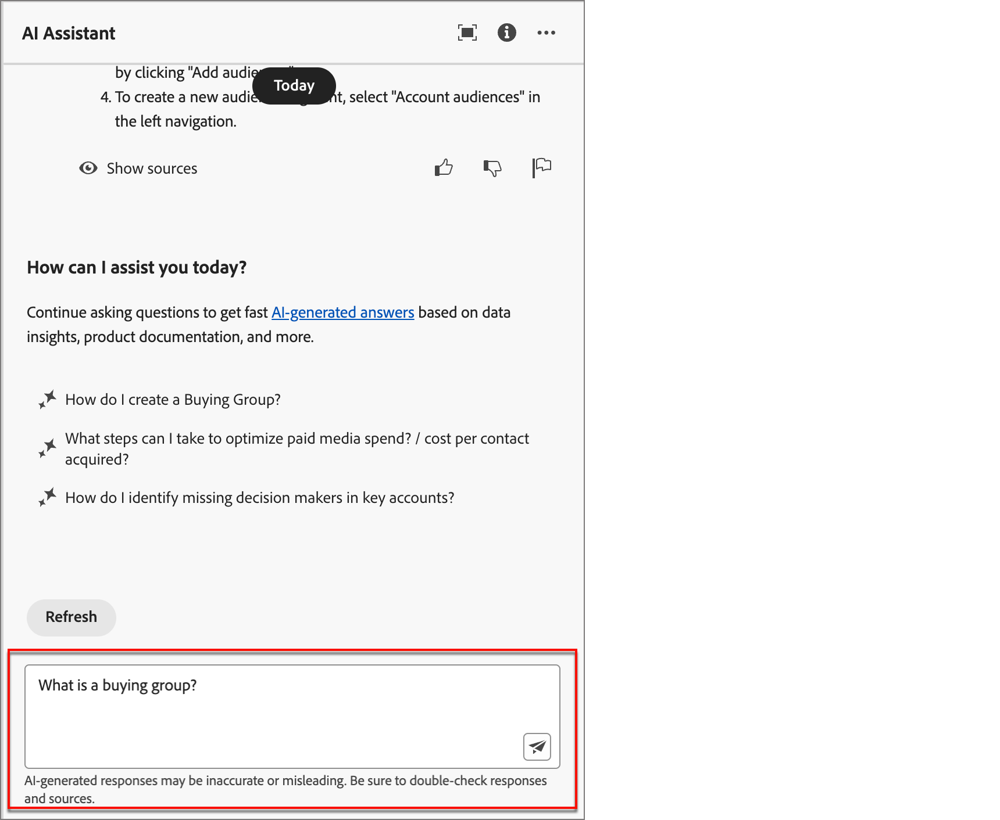

# AI-assistent gebruiken

In de Uitgave van Journey Optimizer B2B, is AI Medewerker een gebruikersinterfaceeigenschap die u kunt gebruiken om op rekening-gebaseerde marketing concepten te begrijpen en snel over de eigenschappen van de Uitgave van Journey Optimizer B2B te navigeren en te leren <!-- get operational insights for your specific environment -->. Het is ook verkrijgbaar in verschillende producten in Adobe Experience Cloud.

U opent de AI-assistent door op het pictogram in de koptekst te klikken. AI Assistant wordt in een deelvenster aan de rechterkant geopend.

{width="600" zoomable="yes"}

>[!IMPORTANT]
>
>U moet akkoord gaan met de Adobe Experience Cloud Generative AI-gebruikersrichtlijnen voordat u de AI Assistant kunt gebruiken. Voor meer informatie over deze overeenkomst en gebruiksrichtlijnen, zie de [ Generatieve AI Richtlijnen van de Gebruiker van Adobe Experience Cloud ](https://www.adobe.com/legal/licenses-terms/adobe-dx-gen-ai-user-guidelines.html).

In Adobe Journey Optimizer B2B Edition biedt AI Assistant ondersteuning voor de volgende gebruiksgevallen:

* **de kennis van het Product** (Beta)

  Vragen over productkennis hebben betrekking op Journey Optimizer B2B Edition-concepten die betrekking hebben op aspecten van Adobe Journey Optimizer. Enkele voorbeelden van productkennisvragen zijn:

   * Hoe kan ik SMS-leveranciersaccounts instellen?
   * Hoe verstuur ik een e-mail in een rekeningreis?
   * Hoe kan ik mijn e-mailinhoud personaliseren?

<!-- 
* **Operational insights** in journeys (Beta)

    Operational insight questions are about the journey objects in your organization's sandbox. Some examples of operational insight questions or prompts include:

    * How many live journeys do I have in Adobe Journey Optimizer?
    * Give me a list of all the scheduled journeys
    * How many Journeys have been created in the last 7 days?

    >[!NOTE]
    >
    >The only Adobe Journey Optimizer B2B Edition object you have access to ask the AI Assistant operational insights questions about is **Journeys**. It will only have data for the sandbox you are currently in.
-->
Als u een vraag wilt stellen, voert u deze in in het veld onder in het deelvenster en drukt u op Enter.

{width="450" zoomable="yes"} in

Controleer het antwoord en gebruik **toon bronnen** knoop om directe verbindingen aan de productdocumentatie te krijgen en meer te leren.

{width="450" zoomable="yes"}

Gebruik het blokje omhoog of omlaag om de kwaliteit van het antwoord te beoordelen.

Leren hoe te om AI Medewerker te gebruiken, zie voorbeelddoelstellingen die u met de AI Medewerker kunt verwezenlijken, en leren hoe AI Medewerker werkt, naar de [ documentatie van Adobe Experience Platform ](https://experienceleague.adobe.com/en/docs/experience-platform/ai-assistant/home) {target="_blank"} verwijzen.
